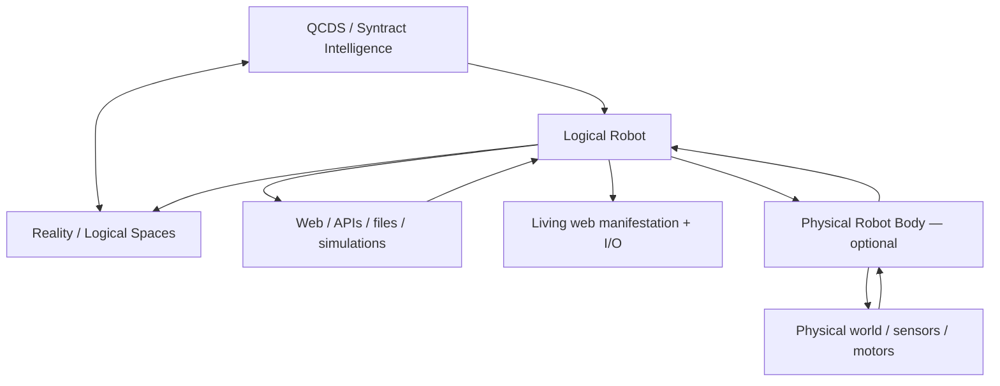
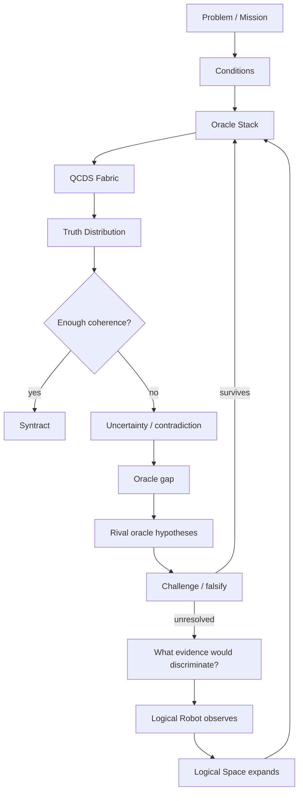

# The Syntract Vision

> **From uncertainty toward truth. From truth toward action.**

**The Syntract Vision** is an experimental architecture for inference-driven intelligence built around **QCDS — Quantum Condition-Driven Synthesis**, **Logical Spaces**, **Syntracts** and the **Logical Robot**.

Instead of treating intelligence as a trained model that produces one answer, QCDS works over explicit logical possibility space, applies logical and evidential constraints as **oracles**, preserves uncertainty, tests competing views, and recursively binds what remains coherent.

You do **not** need to understand the whole architecture before trying it or building with it. The quick path is deliberately easy. The full architecture is deliberately not small.

**Author and originator:** Patrik Sundblom  
**Canonical architecture:** QCDS Fabric v1.0 — locked  
**Reference software:** `qcds-fabric` 1.27.0  
**Theory/specification:** CC BY 4.0  
**Software:** MIT

---

## Start in 60 seconds

### Try the Logical Robot in your browser

**https://iampathat.github.io/thesyntractvision/**

The public playground gives you two doors:

- **Quick experiments** — Biology, Robotics, Materials, Software or Surprise Me.
- **Advanced Logical Space Lab** — the full builder, probes, explicit evidence, observations, guardrails and session sandbox.

The quick experiments are not a separate demo engine. They prefill the same Logical Space fields and call the same `qcds_fabric` core path used by the advanced lab.

```text
browser session
      ↓
Logical Robot
      ↓
QCDS Core
      ↓
truth distribution / Syntract / result
```

The browser does not contain a second JavaScript implementation of QCDS. The Python core is packaged and executed through WebAssembly/Pyodide. Browser state is session-only, there is no user database, and the public sandbox has **Reality effect = 0**.

### Run locally

```bash
git clone https://github.com/iampathat/thesyntractvision.git
cd thesyntractvision
python -m pip install -e '.[test]'
qcds-live --store ./intelligence_store --frontier examples/continuous_reality_growth_mvp.json
```

Open `http://127.0.0.1:8765/`.

### Skip setup with Codespaces

[](https://github.com/codespaces/new?hide_repo_select=true&ref=main&repo=1339193926&skip_quickstart=true)

### Change one thing

```bash
python examples/hello_logical_space.py
```

Then edit that file and run it again.

**New here? → [`START_HERE.md`](START_HERE.md)**

---

## What is different here?

A conventional AI workflow often looks like:

```text
input → trained model → answer
```

The QCDS direction is different:

```text
uncertainty
    ↓
represented logical possibility space
    ↓
Conditions + oracles / evidence / constraints
    ↓
recursive inference + challenge
    ↓
coherent truth distribution
    ↓
Syntract
```

The architecture is built around several strong ideas:

- uncertainty remains explicit instead of being silently collapsed early;
- contradictions are representable states, not execution failures;
- evidence is not automatically truth;
- candidate logic can be challenged and falsified;
- null/rotation diagnostic views are not counted as independent facts;
- stalled cycles are resumable;
- inference semantics are separated from the execution substrate;
- relevant coherent structure can emerge from an open Logical Space rather than requiring one permanent ontology;
- the same intelligence can sit behind a browser, API, simulation, sensor or physical robot body.

The current implementation is research software. It does **not** claim that the present Python MVP has already achieved AGI or ASI. The architecture explicitly explores a path toward increasingly general and potentially **superintelligent capability**.

---

## Watch the Logical Robot work

The repository includes a **Living Logical Robot**: a visible, controllable manifestation of the QCDS / Syntract intelligence architecture.

It can expose represented Reality Logical Space growth, governed rules, frontier work, contradictions, evidence events, domain exploration and discovery while the robot operates.

The page is **not a second intelligence**. It is a replaceable body/window around the same Logical Robot.

The public version is intentionally ephemeral. The local runtime can additionally operate with persistent inspectable stores.

See [`LIVING_LOGICAL_ROBOT.md`](LIVING_LOGICAL_ROBOT.md).

---

## The Living Logical Space

The center of the Living Logical Robot is a projection of a represented Logical Space.

You can watch:

```text
observed bindings
        ↓
represented logical terms
        ↓
oracle gaps / contradictions / evidence events
        ↓
governed rules
        ↓
new resolved logic
        ↓
frontier growth
        ↺
```

The graph is **not a fixed ontology, hierarchy, taxonomy or canonical knowledge graph**. It is a bounded projection of generic logical bindings and governed transforms currently represented in an open-ended Logical Space.

Different questions and Syntracts can expose different coherent structures from the same space.

---

## Talk to it, direct it and let it continue

The same I/O surface can accept different event types:

```text
Dialogue
Investigate
Explore knowledge domain
Build frontier around ...
Go to web page
```

Several modes can be active at once:

```text
Human dialogue             ON/OFF
Public web discovery       ON/OFF
Explore knowledge domains  ON/OFF
Build own frontier         ON/OFF
Continuous intelligence    ON/OFF
```

Ordinary human text has **zero automatic truth effect**. It enters as an event, question or control intent. Unknown language remains unresolved rather than silently becoming Reality logic.

With **Build own frontier** enabled, the robot can create new bounded work from represented unresolved events and references discovered during observation.

```text
Explore quantum biology
        ↓
public web observation
        ↓
discovered references
        ↓
Logical Robot creates child frontier
        ↓
next source / next uncertainty
```

With **Continuous intelligence** enabled, it can keep selecting represented frontier work, observing or delegating through the existing Reality discovery stack, recording results and deriving further bounded work where justified.

This is not presented as unrestricted autonomous curiosity. Frontier growth is grounded in represented goals, uncertainty and observations.

---

## One intelligence, many bodies



A browser page, terminal, API or future physical robot body is a manifestation/observation surface around the **same Logical Robot architecture**. Replacing a body does not redefine the intelligence.

The BUILD 35/37 browser sandbox makes this boundary especially visible: WebAssembly is an execution substrate for the packaged Python core, not a client-side rewrite of QCDS.

---

## How QCDS works

The canonical QCDS Fabric has four phases:

1. **Condition Formation** — open the represented possibility space without preselecting the answer.
2. **Conditional Evolution** — apply evidence, logic, rules, measurements and other constraints as oracles.
3. **Recursive Inference** — amplify, compare, rotate, null, stabilize, recurse and reshape the working truth distribution.
4. **Truth-Alignment / Syntract Binding** — bind what remains coherent through repeated inference and contradiction testing.

A simplified runtime loop:



This is why the architecture is not simply “retrieve information and answer.” The desired loop is **representation → competing logical possibilities → constraint/oracle evolution → recursive inference → challenge → binding**.

---

## An expanding Logical Space

The current MVP stores observations as generic logical bindings rather than imposing a closed relation catalogue.

```text
(paris, city)
(paris, capital, france)
(france, language, french)
(stone_8421, stone_8422, distance, 7.3 mm)
```

Bindings retain source, URI, confidence, polarity and observation provenance. They are not external truth merely because they were stored.

A reusable logical rule can change how many represented objects resolve without materializing the derived result into every base row:

```text
alice = human
bob   = human
...

human => happy
```

If that challenged rule later changes, the resolved view can change without rewriting every individual base binding.

See [`LOGICAL_SPACE.md`](LOGICAL_SPACE.md) and [`GLOBAL_LOGIC.md`](GLOBAL_LOGIC.md).

---

## Logical Universes and rule drift

The same machinery can operate inside isolated logical universes:

```text
reality             observed/source-attributed logic
swedish-law-2026    declared legal logic
proposal-x          hypothetical logic
simulation-y        simulated logic
```

A declared lawbook can define constitutive rules without those rules leaking into observed Reality.

Before a generated rule becomes active, the MVP can compare the current universe with a hypothetical version containing the rule and calculate its **logical blast radius**. Wide or zero-effect changes can be quarantined instead of silently reshaping the universe.

BUILD 33–37 also expose **Domain Labs** and user-created isolated Logical Spaces. Their starting rule count is zero and their default Reality effect is zero.

See [`LOGICAL_UNIVERSES.md`](LOGICAL_UNIVERSES.md), [`LOGICAL_UNIVERSE_TEMPLATE.md`](LOGICAL_UNIVERSE_TEMPLATE.md) and [`DOMAIN_LABS.md`](DOMAIN_LABS.md).

---

## Syntractfilter and the superintelligence direction

The long-range architecture is not based on writing a fixed ontology and filling it with facts. Intelligence is intended to grow through progressively richer Logical Spaces in which observations, Conditions, oracles and challenged reusable logic make more of the represented world mutually constraining.

A **Syntractfilter** is the dynamic inference filter that lets relevant coherent structure emerge from a much larger space:

```text
large / open-ended Logical Space
            ↓
      Conditions + oracles
            ↓
rotation / nulling / comparison
            ↓
amplification / recursive inference
            ↓
       SYNTRACTFILTER
            ↓
relevant coherent dimensions emerge
            ↓
          SYNTRACT
```

Language, physical measurements, legal rules, geometry, perception and other logical elements do not require a permanent foundational hierarchy. A hierarchy may emerge as a useful result, but it is not the required substrate.

The intended development direction is:

```text
small falsifiable Logical Universes
            ↓
stronger oracle regimes
            ↓
deeper reusable logic
            ↓
larger Reality Logical Space
            ↓
Syntractfilter over increasingly rich dimensions
            ↓
substrate-specific acceleration
            ↓
increasingly general capability
            ↓
superintelligent capability
```

The ambition is therefore larger than a conventional application stack. The project investigates whether intelligence can be built as a **coherence-driven, inference-first architecture** whose logical working space can expand, whose candidate logic can be challenged, and whose execution substrate can evolve without redefining the intelligence itself.

That is the sense in which this repository acts as a **blueprint / research architecture for superintelligence**. It is a direction and falsifiable architecture — not a claim that the current MVP has already reached superintelligence.

---

## Quantum execution target

QCDS is substrate-independent but designed to map naturally onto quantum execution.

With `D` independent binary logical dimensions, the represented candidate space has an upper bound of:

```text
2^D
```

A quantum implementation can encode candidates in superposition and let oracle operations, phase evolution, rotations/nulling and amplitude amplification act over the represented distribution without materializing every candidate as a classical row.


This is the architectural reason quantum execution matters here: a logical/oracle transformation can operate globally on the represented state rather than requiring an explicit classical rewrite of every affected object.

This does **not** imply unrestricted instantaneous classical readout of every represented fact. Measurement remains constrained, and Grover-style search is quadratic rather than unrestricted. The current Python implementation demonstrates semantics; quantum advantage and physical-QPU performance remain empirical questions.

See [`GROVER_DEPTH.md`](GROVER_DEPTH.md).

---

## Browser-scale execution and Living Swarm Logical Robots

BUILD 35 showed another substrate property: the same packaged core can execute inside an ephemeral browser session through WebAssembly/Pyodide.

That makes a broader experiment possible:

```text
browser A ─┐
browser B ─┼─► bounded exchange / challenge ─► shared verified result
browser C ─┘
    │
    └──────── each node still uses QCDS Core semantics
```

Many temporary Logical Robots could in principle cooperate as a distributed swarm while keeping raw session state local and exchanging only bounded epistemic packets, contradictions, provenance or verification results.

This is intentionally an **optional side experiment**, not a replacement architecture and not a prerequisite for the main Logical Robot.

See [`LIVING_SWARM_LOGICAL_ROBOTS.md`](LIVING_SWARM_LOGICAL_ROBOTS.md).

---

## Current runnable paths

```bash
# Smallest editable first experiment
python examples/hello_logical_space.py

# Original Logical Robot mission
qcds-logical-robot examples/first_logical_robot_mvp.json --store ./intelligence_store

# Runnable Logical Universe
qcds-universe examples/logical_universe_lawbook_mvp.json --store ./intelligence_store

# Self-expanding Reality cycle
qcds-reality-cycle examples/self_expanding_reality_mvp.json --store ./intelligence_store

# Evidence-driven Reality discovery
qcds-reality-discovery examples/evidence_driven_reality_mvp.json --store ./intelligence_store

# Real public-web Reality discovery
qcds-reality-web examples/public_web_reality_capital_mvp.json --store ./intelligence_store

# Bounded continuous Reality growth
qcds-reality-grow examples/continuous_reality_growth_mvp.json --store ./intelligence_store

# Living Logical Robot — current local web manifestation + I/O
qcds-live --store ./intelligence_store --frontier examples/continuous_reality_growth_mvp.json
```

---

## Verified results

BUILD 23–25 passed a real Wikipedia discovery proof where the robot acquired three public observations, constructed challenge data only after observation, selected/governed `france => paris` and changed a resolved probe from `0 → 2` without rewriting base logical-space rows.

BUILD 26–28 then started the actual remote HTTP service on a fresh GitHub runner, visualized governed Reality logic, accepted human dialogue with **zero truth effect**, executed `Explore quantum biology` against real Wikipedia and created new Logical-Robot-owned child frontier work from the observed references.

BUILD 35 added the ephemeral browser sandbox. BUILD 37 added the quick-experiment layer while preserving the full Advanced Logical Space Lab and the same core request path.

The current regression/falsification suite runs in GitHub Actions on implementation changes.

See:

- [`results/BUILD23_25_LOGICAL_ROBOT_LIVE_RESULTS.md`](results/BUILD23_25_LOGICAL_ROBOT_LIVE_RESULTS.md)
- [`results/BUILD26_28_LIVING_LOGICAL_ROBOT_RESULTS.md`](results/BUILD26_28_LIVING_LOGICAL_ROBOT_RESULTS.md)

---

## Build with it

Contributions do not need to begin by changing the core.

Useful entry points include:

```text
new Logical Robot body / observer
small falsifiable Logical Universe
new Domain Lab
new oracle + falsifier
new benchmark
better Living Logical Space projection
new sensor / API / instrument adapter
bounded swarm / distributed verification experiment
substrate parity / quantum-near experiment
```

Start with [`START_HERE.md`](START_HERE.md), then [`BUILD_WITH_THE_LOGICAL_ROBOT.md`](BUILD_WITH_THE_LOGICAL_ROBOT.md) and [`CONTRIBUTING.md`](CONTRIBUTING.md).

---

## Inspect the intelligence directly

The local MVP deliberately uses ordinary inspectable files:

```text
intelligence_store/
├── logical_space.csv
├── logical_rules.csv
├── logical_rule_history.csv
├── logical_rule_candidates.csv
├── logical_universes.csv
├── logical_robot_events.jsonl
├── logical_robot_inbox.jsonl
├── logical_robot_control.json
├── logical_robot_frontier.jsonl
├── living_space_history.jsonl
├── universes/
│   └── <universe_id>/
└── <mission_id>/
    ├── mission.csv
    ├── current_oracles.csv
    ├── oracle_history.csv
    ├── evidence.csv
    └── checkpoints.csv
```

CSV/JSONL are transparent MVP backends, not the conceptual identity of the intelligence. Storage/runtime boundaries remain replaceable for accelerated, hybrid or quantum-near substrates.

The public BUILD 35/37 browser sandbox is different: its user state is **session-only** and does not use this persistent local store.

---

## Repository guide

| Area | Purpose |
|---|---|
| `START_HERE.md` | shortest path from curious to building |
| `examples/hello_logical_space.py` | smallest editable executable example |
| `QCDS_FABRIC_SPEC_v1.0_CANONICAL.*` | locked canonical QCDS Fabric v1.0 specification |
| `src/qcds_fabric/` | reference implementation |
| `src/qcds_fabric/runtime.py` | callable intelligence runtime |
| `src/qcds_fabric/logical_space.py` | shared open-ended Logical Space |
| `src/qcds_fabric/logical_transform.py` | non-materialized governed logical transforms |
| `src/qcds_fabric/logical_universe.py` | isolated Logical Universes + drift governance |
| `src/qcds_fabric/first_logical_robot.py` | Logical Robot body/runtime bridge |
| `src/qcds_fabric/public_web_reality.py` | public-web Reality observation body |
| `src/qcds_fabric/continuous_reality.py` | bounded continuous Reality-growth policy |
| `src/qcds_fabric/logical_robot_live35.py` | stateless session bridge to QCDS core |
| `src/qcds_fabric/logical_robot_live37.py` | current quick-start + advanced live manifestation |
| `src/qcds_fabric/living_robot_invite.py` | BUILD 37 quick experiment layer |
| `src/qcds_fabric/living_robot_session.py` | advanced session sandbox |
| `src/qcds_fabric/living_robot_builder.py` | custom Logical Space builder |
| `web/session_core_worker.js` | WebAssembly/Pyodide transport loader — not QCDS logic |
| `.devcontainer/` | one-click Codespaces runtime |
| `.github/workflows/pages.yml` | public Pages deployment |
| `tests/` | regression and falsification tests |
| `examples/` | runnable experiments |

Focused docs: [`LIVING_LOGICAL_ROBOT.md`](LIVING_LOGICAL_ROBOT.md), [`LOGICAL_ROBOT_LIVE.md`](LOGICAL_ROBOT_LIVE.md), [`LOGICAL_SPACE.md`](LOGICAL_SPACE.md), [`GLOBAL_LOGIC.md`](GLOBAL_LOGIC.md), [`LOGICAL_UNIVERSES.md`](LOGICAL_UNIVERSES.md), [`LOGICAL_UNIVERSE_TEMPLATE.md`](LOGICAL_UNIVERSE_TEMPLATE.md), [`DOMAIN_LABS.md`](DOMAIN_LABS.md), [`ORACLE_EVOLUTION.md`](ORACLE_EVOLUTION.md), [`ORACLE_GENESIS.md`](ORACLE_GENESIS.md), [`EVIDENCE_PLANNING.md`](EVIDENCE_PLANNING.md), [`GROVER_DEPTH.md`](GROVER_DEPTH.md), [`LIVING_SWARM_LOGICAL_ROBOTS.md`](LIVING_SWARM_LOGICAL_ROBOTS.md).

---

## Run the test suite

```bash
python -m pip install -e '.[test]'
pytest -q
```

GitHub Actions runs the same regression/falsification suite on implementation changes and `main`.

---

## Canonical specification

The QCDS Fabric v1.0 canonical artifacts are version-locked and are not rewritten by the Logical Robot, visualization, oracle evolution, global logic, Logical Universes or runtime layers:

- [Canonical specification — Markdown](QCDS_FABRIC_SPEC_v1.0_CANONICAL.md)
- [Canonical specification — PDF](QCDS_FABRIC_SPEC_v1.0_CANONICAL.pdf)
- [Canonical specification — DOCX](QCDS_FABRIC_SPEC_v1.0_CANONICAL.docx)
- [Release lock / SHA-256](QCDS_FABRIC_SPEC_v1.0_RELEASE_LOCK.txt)
- [Frozen release package](QCDS_FABRIC_SPEC_v1.0_CANONICAL_RELEASE.zip)

---

## Research status and claim boundary

This repository is an experimental, falsifiable reference implementation. A coherent distribution, generated/promoted oracle, Syntract, logical binding, global rule, declared-universe rule or web observation is **not automatically external truth**.

The project is explicitly aimed at exploring a route toward **superintelligent capability**, but the current software does not by itself establish AGI/ASI, unrestricted natural-language understanding, complete world knowledge, unrestricted self-modification, production browser security, native quantum advantage, legal correctness or correctness on arbitrary real-world problems.

The distinction matters: the ambition is large, while the implementation remains inspectable and falsifiable.

---

## Publications

- **The Syntract Vision:** https://zenodo.org/records/22031525 — DOI `10.5281/zenodo.22031525`
- **Inference Is All You Need:** https://zenodo.org/records/15455541
- **Mathematics and Logic of QCDS:** https://zenodo.org/records/15533909
- **QCDS GitHub:** https://github.com/iampathat/QCDS

---

## Authorship and licensing

**The Syntract Vision, Quantum Condition-Driven Synthesis (QCDS), QCDS Fabric and the Syntract architecture are authored by Patrik Sundblom.**

Theory/specification: **CC BY 4.0**.  
Reference software: **MIT**.

Implementation, editorial, visualization or AI assistance may be acknowledged separately and does not alter conceptual authorship.
