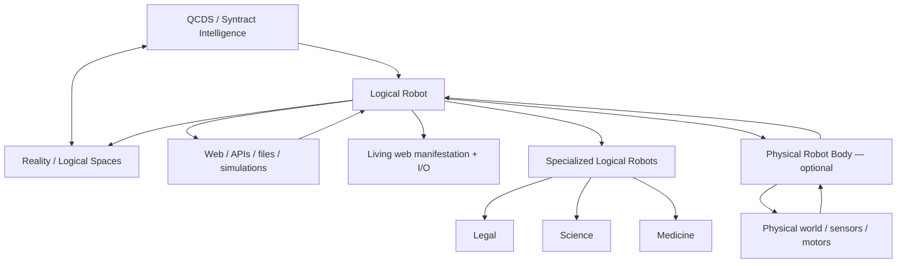
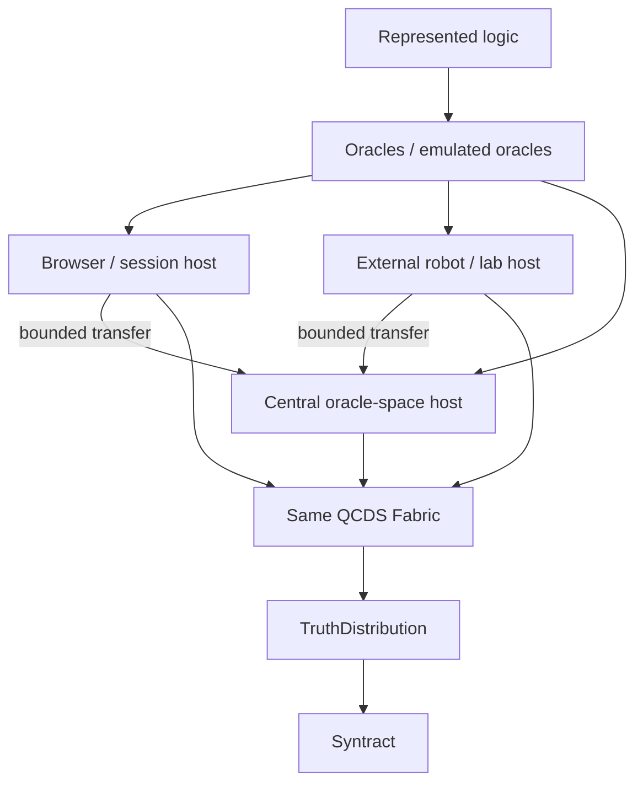
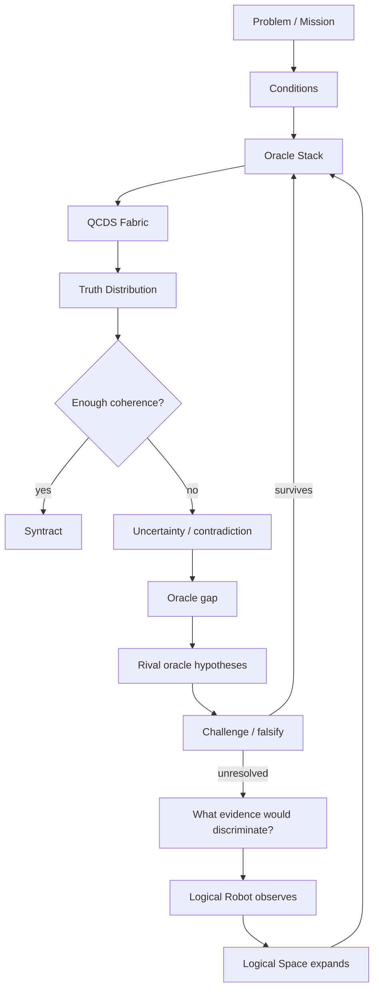
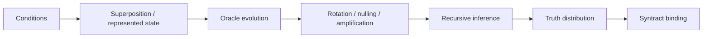

# The Syntract Vision

> **From uncertainty toward truth. From truth toward action.**

**The Syntract Vision** is an experimental architecture for inference-driven intelligence built around **QCDS — Quantum Condition-Driven Synthesis**, **Logical Spaces**, **Syntracts** and the **Logical Robot**.

Instead of treating intelligence as a trained model that produces one answer, QCDS works over explicit logical possibility space, applies logical and evidential constraints as **oracles**, preserves uncertainty, tests competing views, and recursively binds what remains coherent.

You do **not** need to understand the whole architecture before trying it or building with it. The quick path is deliberately easy. The full architecture is deliberately not small.

**Author and originator:** Patrik Sundblom  
**Canonical architecture:** QCDS Fabric v1.0 — locked  
**Reference software:** `qcds-fabric` 1.30.0  
**Theory/specification:** CC BY 4.0  
**Software:** MIT

---

## Start in 60 seconds

### Try the Logical Robot in your browser

**https://iampathat.github.io/thesyntractvision/**

The public playground now opens with a **Visual Logical Robot** and gives you five doors into the same QCDS / Syntract architecture:

- **Visual Logical Robot** — draw or erase obstacles and watch the same QCDS/Syntract system re-infer a shortest coherent route as the represented world changes.
- **Try QCDS** — Biology, Robotics, Materials, Software or Surprise Me as small inspectable Logical Spaces.
- **Syntracts** — run several complete bound Syntracts as parallel QCDS branches, re-enter their full TruthDistributions into one joint Logical Space, and bind a higher-order Syntract.
- **Legal Robot** — a substantial specialized Logical Robot over a source-attributed Swedish housing-law Logical Universe.
- **Advanced** — the full builder, probes, explicit evidence, observations, guardrails and session sandbox.

These are capability surfaces around the same system, not separate intelligences. Quick QCDS experiments prefill the same Logical Space fields and call the same `qcds_fabric` core path used by the advanced lab. The Visual Logical Robot enters through `SyntractSystem` and its existing `FabricLayer`; it does not use a separate browser pathfinder or a second JavaScript QCDS implementation.

The Swedish Law surface is deeper: it forms an active legal `2^N` problem, runs the shared QCDS Fabric, exposes **Classical Exact** and **Grover-emulated statevector** executions, and separately exposes the **Quantum Full Space** native-QPU target contract where semantic prefiltering is forbidden.

```text
browser session
      ↓
Logical Robot / specialized body
      ↓
QCDS Core
      ↓
truth distribution / Syntract / result
```

The browser does not contain a second JavaScript implementation of QCDS. The Python core is packaged and executed through WebAssembly/Pyodide. Browser state is session-only, there is no user database, and the public sandbox has **Reality effect = 0**.

### Run locally

```bash
git clone https://github.com/iampathat/thesyntractvision.git
cd thesyntractvision
python -m pip install -e '.[test]'
qcds-live --store ./intelligence_store --frontier examples/continuous_reality_growth_mvp.json
```

Open `http://127.0.0.1:8765/`.

### Skip setup with Codespaces

[](https://github.com/codespaces/new?hide_repo_select=true&ref=main&repo=1339193926&skip_quickstart=true)

### Change one thing

```bash
python examples/hello_logical_space.py
```

Then edit that file and run it again.

**New here? → [`START_HERE.md`](START_HERE.md)**

---

## What is different here?

A conventional AI workflow often looks like:

```text
input → trained model → answer
```

The QCDS direction is different:

```text
uncertainty
    ↓
represented logical possibility space
    ↓
Conditions + oracles / evidence / constraints
    ↓
recursive inference + challenge
    ↓
coherent truth distribution
    ↓
Syntract
```

The architecture is built around several strong ideas:

- uncertainty remains explicit instead of being silently collapsed early;
- contradictions are representable states, not execution failures;
- evidence is not automatically truth;
- hard constraints and probabilistic evidence can coexist in one Logical Space;
- candidate logic can be challenged and falsified;
- null/rotation diagnostic views are not counted as independent facts;
- stalled cycles are resumable;
- inference semantics are separated from the execution substrate;
- relevant coherent structure can emerge from an open Logical Space rather than requiring one permanent ontology;
- the same intelligence can sit behind a browser, API, simulation, sensor, specialized domain robot or physical robot body.

The current implementation is research software. It does **not** claim that the present Python MVP has already achieved AGI or ASI. The architecture explicitly explores a path toward increasingly general and potentially **superintelligent capability**.

---

## Watch the Logical Robot work

The repository includes a **Living Logical Robot**: a visible, controllable manifestation of the QCDS / Syntract intelligence architecture.

It can expose represented Reality Logical Space growth, governed rules, frontier work, contradictions, evidence events, domain exploration and discovery while the robot operates.

The page is **not a second intelligence**. It is a replaceable body/window around the same Logical Robot.

The public version is intentionally ephemeral. The local runtime can additionally operate with persistent inspectable stores.

See [`LIVING_LOGICAL_ROBOT.md`](LIVING_LOGICAL_ROBOT.md).

---

## Visual Logical Robot — see the architecture before reading it

The public front door is deliberately concrete: a small robot moves from **A** to **B** while you change the represented world by drawing or erasing obstacle cells.

```text
finger / mouse changes the world
        ↓
drawn cells become explicit obstacle oracles
        ↓
8 binary QCDS Conditions represent up to 2^8 = 256 position states
        ↓
QCDS re-infers the viable route space
        ↓
TruthDistribution / shortest surviving route family
        ↓
route Syntract
        ↓
one representative route is manifested by the visual robot body
```

The default 20 × 12 world contains **240 represented cells**, encoded in an **8-bit QCDS position space** rather than pretending that every cell is an independent QCDS dimension. A drawn obstacle such as `(9,6)` becomes explicit oracle logic equivalent to `position != (9,6)`.

The implementation enters through the same `SyntractSystem` boundary and `FabricLayer` used by the rest of the architecture. It preserves multiple equal shortest routes when they survive and binds the route family without claiming that one representative path is uniquely true. The faint alternative route preview is presentation of that already-inferred route family, not a second pathfinder.

The browser version is a **classical emulation** of the represented/oracle-driven route-space idea. It does not claim that the browser is a physical quantum computer or that the current demonstration establishes quantum speedup.

This makes the body boundary visible:

```text
VISUAL BODY                         PHYSICAL BODY
finger / mouse → canvas             camera / lidar → motors
                 \                 /
                  SAME QCDS / SYNTRACT SYSTEM
```

Replacing the visual body with sensors and actuators changes input/output and oracle formation; it does not create a second intelligence architecture.

---

## The Living Logical Space

The center of the Living Logical Robot is a projection of a represented Logical Space.

```text
observed bindings
        ↓
represented logical terms
        ↓
oracle gaps / contradictions / evidence events
        ↓
governed rules
        ↓
new resolved logic
        ↓
frontier growth
        ↺
```

The graph is **not a fixed ontology, hierarchy, taxonomy or canonical knowledge graph**. It is a bounded projection of generic logical bindings and governed transforms currently represented in an open-ended Logical Space.

Different questions and Syntracts can expose different coherent structures from the same space.

---

## Talk to it, direct it and let it continue

The same I/O surface can accept different event types:

```text
Dialogue
Investigate
Explore knowledge domain
Build frontier around ...
Go to web page
```

Several modes can be active at once:

```text
Human dialogue             ON/OFF
Public web discovery       ON/OFF
Explore knowledge domains  ON/OFF
Build own frontier         ON/OFF
Continuous intelligence    ON/OFF
```

Ordinary human text has **zero automatic truth effect**. It enters as an event, question or control intent. Unknown language remains unresolved rather than silently becoming Reality logic.

With **Build own frontier** enabled, the robot can create new bounded work from represented unresolved events and references discovered during observation.

```text
Explore quantum biology
        ↓
public web observation
        ↓
discovered references
        ↓
Logical Robot creates child frontier
        ↓
next source / next uncertainty
```

With **Continuous intelligence** enabled, it can keep selecting represented frontier work, observing or delegating through the existing Reality discovery stack, recording results and deriving further bounded work where justified.

This is not presented as unrestricted autonomous curiosity. Frontier growth is grounded in represented goals, uncertainty and observations.

---

## One intelligence, many bodies



A browser page, terminal, API, specialized domain robot or future physical robot body is a manifestation/capability surface around the **same Logical Robot architecture**. Replacing or adding a body does not redefine the intelligence.

**Logical Robot does not contain QCDS. Logical Robot talks to QCDS.**

WebAssembly is an execution substrate for the packaged Python core, not a client-side rewrite of QCDS.

### Unified composition boundary: `SyntractSystem`

New integrations should normally enter through one system boundary:

```python
from qcds_fabric import SyntractSystem

system = SyntractSystem()
```

`SyntractSystem` does **not** replace the QCDS core, redefine Syntract, or create a manager intelligence above QCDS. It is the composition boundary that connects the existing problem-to-Syntract path, `FabricLayer`, central topology, mission/runtime, swarm/evidence loops and replaceable Logical Robot bodies while fundamental inference remains in QCDS.

The engineering rule is simple:

> A new capability may add representations, oracles, tools, bodies, sensors, actions or I/O — but it must not quietly introduce a second inference engine beside QCDS.

---

## Oracle-space topology: session, external and central

Questions, material and observations are translated into a **Logical Space**. **Oracles or emulated oracles act as filters / constraints over that Logical Space.** Hosting does not redefine the logic and does not create a second QCDS architecture.

The same `BaseBundle + OracleStack` contract can now be hosted in an ephemeral browser/session, an external runtime or a central high-capacity fabric. Oracle spaces can be exported and imported with Logical Universe identity and provenance preserved.



Transfer is **not truth promotion**. An imported oracle space retains source and universe provenance; it can be challenged, reconciled and re-entered through QCDS before anything is bound.

Software execution is resource-aware without changing QCDS semantics. The reference defaults currently distinguish:

```text
browser / Pyodide session       up to 16 live emulation dimensions
local MacBook-class machine     up to 20 live emulation dimensions
central software fabric         up to 22 live emulation dimensions
```

Those are practical emulator defaults, **not QCDS limits**. They can evolve with hardware and implementation performance.

When active praxis or another optional software layer exceeds a profile, the emulator may form an explicit capacity-bounded execution projection and must report what was executed and what was projected out. The projection is not a truth ranking. If the statutory/core active room itself exceeds the selected software profile, the implementation requires a larger profile or a semantics-preserving QCDS/Syntract decomposition instead of silently cutting logical dimensions.

**Quantum Full Space does not inherit these browser/MacBook/central software limits.** Its represented universe remains complete by contract.

---

## Specialized Logical Robots

Large real-world domains should not be mixed into one implementation pile.

Substantial domain robots live under [`robots/`](robots/):

```text
robots/
├── legal/
│   ├── sweden_housing/
│   └── future_us_.../
├── medicine/
├── science/
└── ...
```

A specialized Logical Robot can own its domain corpus, case fixtures, source mappings, domain-specific interpretation layers and benchmarks while still calling the **same QCDS / Syntract core**.

The first substantial domain robot is [`robots/legal/sweden_housing/`](robots/legal/sweden_housing/). It represents Swedish housing law as a mixed Logical Universe containing hard statutory structure, transition rules, exceptions, open-textured concepts, probabilistic case evidence and source-attributed praxis.

The architecture now distinguishes three execution modes:

```text
Swedish Housing Legal Robot
        │
        ├── Jordabalk / private-letting corpus
        ├── case facts
        ├── probabilistic evidence
        └── praxis
                 │
                 ▼
             QCDS CONDITIONS
                 │
        ┌────────┼───────────────┐
        ▼        ▼               ▼
CLASSICAL     GROVER       QUANTUM FULL SPACE
 EXACT       EMULATED        TARGET CONTRACT
bounded      bounded         full represented
projection   statevector     logical universe
exact 2^N    phase/Grover    no semantic prefilter
        │        │               │
        └───┬────┘               │
            ▼                    │
 TruthDistribution(s)            │
            ▼                    ▼
         Syntract        future native QPU
```

**Classical Exact** and **Grover Emulated** are software modes. Their Condition Formation may project the complete represented legal universe into a bounded active room because classical memory and statevector emulation are finite. Once that active room is declared, it is executed without silently deleting its candidate states.

**Quantum Full Space** is different. It is a native-QPU target contract and **does not permit represented legal dimensions to be removed merely because they look irrelevant or are inconvenient for classical memory**. The target is to let Conditions, oracle interaction, amplitude evolution and recursive QCDS make relevance emerge from the represented universe.

The current build records a separate full-universe manifest for that target. It is not pretending that the software statevector emulator is a physical QPU.

The preliminary legal resolver does **not** install the final legal outcome before QCDS runs. Legal consequences, assessment states and evidence-sensitive propositions remain live QCDS dimensions where appropriate.

Praxis can expand the statutory room through **Syntract re-entry**: the statutory TruthDistribution is carried forward through `DistributionOracle`, active precedent dimensions are added in the emulation path, and QCDS runs again before the final Legal Syntract is bound. In the Quantum Full Space target, the represented praxis layer remains part of the complete target universe rather than having to be classically judged irrelevant first.

A Legal Logical Robot can also participate as one capability inside a Living Swarm Logical Robot system. Its output remains non-authoritative until challenged/bound through the shared architecture.

See [`robots/legal/sweden_housing/QCDS_EXECUTION.md`](robots/legal/sweden_housing/QCDS_EXECUTION.md).

---

## How QCDS works

The canonical QCDS Fabric has four phases:

1. **Condition Formation** — open the represented possibility space without preselecting the answer.
2. **Conditional Evolution** — apply evidence, logic, rules, measurements and other constraints as oracles.
3. **Recursive Inference** — amplify, compare, rotate, null, stabilize, recurse and reshape the working truth distribution.
4. **Truth-Alignment / Syntract Binding** — bind what remains coherent through repeated inference and contradiction testing.

A simplified runtime loop:



This is why the architecture is not simply “retrieve information and answer.” The desired loop is **representation → competing logical possibilities → constraint/oracle evolution → recursive inference → challenge → binding**.

### Hard constraints and probabilities can coexist

An oracle need not always express the same epistemic character.

```text
hard statutory constraint       confidence 1.0
instrument reading              confidence 0.99
strong documentary evidence     confidence 0.95
ambiguous factual evidence      confidence 0.74
counter-evidence                confidence 0.82 against
```

QCDS can therefore preserve a wide distribution when important discriminators remain uncertain, while converging near 100% when the represented constraints and evidence strongly align.

A probability shown by a QCDS run is **probability mass / coherence in the represented logical universe under the supplied oracle semantics**. It should not automatically be described as an empirically calibrated real-world outcome probability unless that calibration has separately been demonstrated.

---

## An expanding Logical Space

The current MVP stores observations as generic logical bindings rather than imposing a closed relation catalogue.

```text
(paris, city)
(paris, capital, france)
(france, language, french)
(stone_8421, stone_8422, distance, 7.3 mm)
```

Bindings retain source, URI, confidence, polarity and observation provenance. They are not external truth merely because they were stored.

A reusable logical rule can change how many represented objects resolve without materializing the derived result into every base row:

```text
alice = human
bob   = human
...

human => happy
```

If that challenged rule later changes, the resolved view can change without rewriting every individual base binding.

See [`LOGICAL_SPACE.md`](LOGICAL_SPACE.md) and [`GLOBAL_LOGIC.md`](GLOBAL_LOGIC.md).

---

## Logical Universes and rule drift

The same machinery can operate inside isolated logical universes:

```text
reality             observed/source-attributed logic
swedish-law-2026    declared legal logic
proposal-x          hypothetical logic
simulation-y        simulated logic
```

A declared lawbook can define constitutive rules without those rules leaking into observed Reality.

Before a generated rule becomes active, the implementation can compare the current universe with a hypothetical version containing the rule and calculate its **logical blast radius**. Wide or zero-effect changes can be quarantined instead of silently reshaping the universe.

Domain Labs and user-created Logical Spaces start isolated from Reality unless explicitly governed otherwise.

See [`LOGICAL_UNIVERSES.md`](LOGICAL_UNIVERSES.md), [`LOGICAL_UNIVERSE_TEMPLATE.md`](LOGICAL_UNIVERSE_TEMPLATE.md) and [`DOMAIN_LABS.md`](DOMAIN_LABS.md).

---

## Syntractfilter and the superintelligence direction

The long-range architecture is not based on writing a fixed ontology and filling it with facts. Intelligence is intended to grow through progressively richer Logical Spaces in which observations, Conditions, oracles and challenged reusable logic make more of the represented world mutually constraining.

A **Syntractfilter** is the dynamic inference filter that lets relevant coherent structure emerge from a much larger space:

```text
large / open-ended Logical Space
            ↓
      Conditions + oracles
            ↓
rotation / nulling / comparison
            ↓
amplification / recursive inference
            ↓
       SYNTRACTFILTER
            ↓
relevant coherent dimensions emerge
            ↓
          SYNTRACT
```

Language, physical measurements, legal rules, geometry, perception and other logical elements do not require a permanent foundational hierarchy. A hierarchy may emerge as a useful result, but it is not the required substrate.

The intended development direction is:

```text
small falsifiable Logical Universes
            ↓
stronger oracle regimes
            ↓
deeper reusable logic
            ↓
larger Reality Logical Space
            ↓
Syntractfilter over increasingly rich dimensions
            ↓
substrate-specific acceleration
            ↓
increasingly general capability
            ↓
superintelligent capability
```

The ambition is therefore larger than a conventional application stack. The project investigates whether intelligence can be built as a **coherence-driven, inference-first architecture** whose logical working space can expand, whose candidate logic can be challenged, and whose execution substrate can evolve without redefining the intelligence itself.

That is the sense in which this repository acts as a **blueprint / research architecture for superintelligence**. It is a direction and falsifiable architecture — **not a claim that the current MVP has already reached superintelligence**.

---

## Quantum execution target

QCDS is substrate-independent but designed to map naturally onto quantum execution.

With `D` independent binary logical dimensions, the represented candidate space has an upper bound of:

```text
2^D
```

A quantum implementation can encode candidates in superposition and let oracle operations, phase evolution, rotations/nulling and amplitude amplification act over the represented distribution without materializing every candidate as a classical row.



The reference software now makes the execution boundary explicit:

```text
                     QCDS LOGICAL UNIVERSE
                              │
          ┌───────────────────┼────────────────────┐
          ▼                   ▼                    ▼
 CLASSICAL EXACT       GROVER EMULATED      QUANTUM FULL SPACE
 reference emulator    software statevector   native-QPU target
 bounded projection    bounded projection     full universe retained
 exact active 2^N      weighted phase/Grover  no semantic prefilter
          │                   │                    │
          └─────────────┬─────┘                    │
                        ▼                          │
             stabilized distributions             │
                        ▼                          ▼
                 sibling Syntracts        future native execution
```

### Emulator modes may project

Classical Exact and Grover Emulated are **resource-bounded software modes**. It is legitimate for their Condition Formation to create a smaller active room from a much larger represented universe because the classical reference must enumerate states and the statevector emulator must materialize amplitudes in memory.

That projection is not the identity of QCDS. It is an implementation concession.

Once an active emulation room is declared, the implementation does not silently remove states from that declared room. Grover emulation may use exact separable partitions where the Oracle Stack proves separability; coupled oversized components are not fake-chunked.

The resource profile is environment-specific rather than semantic. A browser may therefore execute a smaller bounded emulation room than a MacBook or central software host while all three still use the same QCDS four-phase architecture, oracle semantics and Syntract binding.

### Quantum Full Space must not prefilter away the universe

The native quantum target follows the opposite rule:

> **Do not remove represented logical dimensions merely because a classical machine thinks they are irrelevant or cannot fit them in RAM.**

In that mode, the point is precisely that relevance can emerge from global logical/oracle interaction. A relation that looks irrelevant before inference can become decisive after several interacting dimensions — whether the domain is law, DNA, materials, medicine or another large Logical Universe.

The current legal implementation therefore builds a separate **full-universe manifest** for `quantum_full_space`. It includes every represented rule antecedent/consequence in the loaded corpus, every represented precedent dimension and associated represented factors, plus case/evidence terms. The manifest is independent of the smaller active emulation bundle.

```text
CLASSICAL / GROVER EMULATION
full universe → resource-aware active projection → bounded execution

QUANTUM FULL SPACE TARGET
full represented universe → Conditions/oracles/amplitude evolution → relevance emerges
```

`quantum_full_space` is currently a **target contract only**. No physical QPU backend is connected, and the software does not pretend the statevector emulator is native quantum execution.

Parallel, sequential and hybrid execution remain valid for the quantum target only when the decomposition itself is a semantics-preserving QCDS/Syntract operation over the complete represented universe — not a classical relevance filter disguised as quantum execution.

This does **not** imply unrestricted instantaneous classical readout of every represented fact. Measurement remains constrained, and Grover-style search is quadratic rather than unrestricted. Native quantum advantage and physical-QPU performance remain empirical questions.

See [`GROVER_DEPTH.md`](GROVER_DEPTH.md) and [`robots/legal/sweden_housing/QCDS_EXECUTION.md`](robots/legal/sweden_housing/QCDS_EXECUTION.md).

---

## Parallel Syntract composition

A complete Syntract can re-enter QCDS without being collapsed to one answer. Parallel composition uses the existing QCDS topology rather than a voting or fusion engine:

```text
bound Syntract A ─► full TruthDistribution ─┐
bound Syntract B ─► full TruthDistribution ─┼─► parallel QCDS branches
bound Syntract C ─► full TruthDistribution ─┘
                                            ↓
                                   joint Logical Space
                                            +
                                  explicit cross-oracles
                                            ↓
                                           QCDS
                                            ↓
                                  higher-order Syntract
```

Each source branch retains its own uncertainty. Cross-domain relationships enter only through explicit cross-oracles. The implementation records that parallel execution and joint QCDS re-entry occurred, while **hard collapse remains false** and **no new inference/fusion engine is introduced**.

The public **Syntracts** surface includes synthetic biomedicine, investigation and robotics examples. On mobile, the execution status and result are mounted directly beneath the example that was run so the user does not have to scroll past unrelated examples to find the higher-order result.

---

## Browser-scale execution, QCDS-driven swarm and central fabric

The same packaged core can execute inside an ephemeral browser session through WebAssembly/Pyodide, locally on a larger machine, or behind a central oracle-space host.

The reference implementation now includes a bounded **QCDS-driven swarm loop**. Swarm intelligence is not majority voting and is not a second agent-manager intelligence layer. QCDS uncertainty identifies useful frontier work; Logical Robots gather evidence, attempt falsification, perform independent verification or test alternatives; their results return as oracle manifestations and re-enter the same QCDS Fabric.

```text
QCDS TruthDistribution
        │
        ▼
where is uncertainty / contradiction?
        │
   ┌────┼───────────────┐
   ▼    ▼               ▼
Robot A Robot B        Robot C
observe falsify       verify / alternative
   │    │               │
   └────┼───────────────┘
        ▼
new / challenging oracles
        │
        ▼
     same QCDS
        │
        ▼
TruthDistribution → Syntract
        ↺
```

Multiple temporary or specialized Logical Robots can therefore cooperate while exchanging bounded epistemic packets, contradictions, provenance, evidence and verification results rather than blindly merging private state.

Specialized robots can join that model:

```text
Legal Robot ───────┐
Evidence Robot ────┼─► oracle/evidence packets ─► QCDS challenge / re-entry
Science Robot ─────┤
Sensor Robot ──────┘
```

`CentralQCDSFabric` provides the execution topology for multiple compatible oracle spaces. Independent rooms can execute in parallel; sequential stages can re-enter a prior TruthDistribution through `DistributionOracle`; hybrid execution can run sequential lanes concurrently. It does not silently merge incompatible Logical Universes or invent semantic mappings between them.

Here **parallel topology is semantic, while transport is substrate-dependent**. Native Python may execute independent branches concurrently with worker threads. Standard Pyodide/WebAssembly cannot normally create those OS threads, so the browser executes the same independent branch contracts deterministically on one thread. The Logical Spaces, oracle regimes, QCDS passes and resulting TruthDistributions are unchanged by that scheduling choice. A runtime thread failure also falls back to the same semantics-preserving transport rather than changing the inference model.

This remains the **same QCDS architecture**: question / material → translator → Logical Space → oracle filters / emulated oracle filters → QCDS four phases → TruthDistribution → Syntract.

See [`LIVING_SWARM_LOGICAL_ROBOTS.md`](LIVING_SWARM_LOGICAL_ROBOTS.md).

---

## Current runnable paths

```bash
# Smallest editable first experiment
python examples/hello_logical_space.py

# Original Logical Robot mission
qcds-logical-robot examples/first_logical_robot_mvp.json --store ./intelligence_store

# Runnable Logical Universe
qcds-universe examples/logical_universe_lawbook_mvp.json --store ./intelligence_store

# Swedish Housing Law Logical Robot — Classical Exact + Grover Emulated,
# with Quantum Full Space target manifest exposed in the result
qcds-legal-robot robots/legal/sweden_housing/cases/new_private_let_2026.json

# Probabilistic legal evidence case
qcds-legal-robot robots/legal/sweden_housing/cases/jb_probabilistic_sublet_evidence_2026.json

# Self-expanding Reality cycle
qcds-reality-cycle examples/self_expanding_reality_mvp.json --store ./intelligence_store

# Evidence-driven Reality discovery
qcds-reality-discovery examples/evidence_driven_reality_mvp.json --store ./intelligence_store

# Public-web Reality discovery
qcds-reality-web examples/public_web_reality_capital_mvp.json --store ./intelligence_store

# Bounded continuous Reality growth
qcds-reality-grow examples/continuous_reality_growth_mvp.json --store ./intelligence_store

# Living Logical Robot — local web manifestation + I/O
qcds-live --store ./intelligence_store --frontier examples/continuous_reality_growth_mvp.json
```

---

## What is already verifiable

The repository contains regression and falsification tests for the architectural boundaries it currently implements, including:

- Logical Space representation and governed logical transforms;
- isolated Logical Universes and rule drift/blast-radius checks;
- evidence-driven Reality observation with source provenance;
- Logical Robot I/O where ordinary dialogue has zero automatic truth effect;
- bounded frontier growth and public-web observation;
- browser-session execution through the packaged Python core rather than duplicated JavaScript inference;
- quick and advanced Logical Space interfaces using the same core path;
- Swedish housing law projected into a direct active QCDS `2^N` room rather than a finished rule-engine answer;
- source-attributed legal consequences remaining live dimensions until QCDS evaluates them;
- statutory Syntract re-entry through `DistributionOracle` before active praxis is bound into the final Legal Syntract;
- probabilistic case evidence acting as source-attributed oracle pressure instead of being silently promoted to fact;
- the same active legal `BaseBundle + Oracle Stack` executing through Classical Exact and adaptive Grover-statevector substrates;
- exact-vs-Grover benchmark metrics where the emulated substrate is allowed to diverge or lose;
- dependency-aware bounded parallel Grover execution for separable components;
- explicit refusal to silently truncate or fake-partition an oversized coupled active room;
- explicit **Quantum Full Space** target semantics that forbid semantic prefiltering for classical memory convenience;
- a separate full-universe quantum manifest that retains represented rules/praxis even when the current classical case projection does not need them;
- regression tests that fail if Quantum Full Space is given a reduced set of represented dimensions or is routed through a fake software-QPU backend;
- session/external/central oracle-space transport that preserves universe identity and provenance without promoting imported content to truth;
- QCDS-driven swarm frontier selection and oracle re-entry rather than majority-vote aggregation;
- central parallel/sequential/hybrid oracle-space execution with explicit `DistributionOracle` re-entry;
- environment-specific emulator profiles where browser, local and central software capacities may differ without changing QCDS semantics;
- explicit emulation-projection provenance showing which active praxis dimensions were executed or projected out while Quantum Full Space remains unaffected;
- Visual Logical Robot routing through `SyntractSystem` / the existing `FabricLayer`, with a 20 × 12 grid represented inside an 8-bit (`2^8`) position space and drawn obstacles expressed as explicit oracles rather than browser pre-scoring;
- shortest-route-family binding that can preserve several equal shortest routes while manifesting only one representative route through the visual body;
- complete Syntract-to-Syntract parallel composition through existing QCDS branches, full TruthDistribution re-entry, explicit cross-oracles and higher-order Syntract binding — with no voting, hard collapse or separate fusion engine;
- threadless Pyodide/WASM execution of logically parallel Central Fabric branches without constructing `ThreadPoolExecutor`, while native Python retains concurrent transport when available.

GitHub Actions runs the regression/falsification suite on implementation changes.

Detailed historical development logs, where retained, belong in `results/`, domain-specific working docs and commit history rather than defining this README.

---

## Build with it

Contributions do not need to begin by changing the core.

Useful entry points include:

```text
new Logical Robot body / observer
new specialized Logical Robot under robots/
small falsifiable Logical Universe
new Domain Lab
new oracle + falsifier
new probabilistic evidence source
new benchmark
new execution substrate
better Living Logical Space projection
new sensor / API / instrument adapter
bounded swarm / distributed verification experiment
substrate parity / quantum-near experiment
```

Start with [`START_HERE.md`](START_HERE.md), then [`BUILD_WITH_THE_LOGICAL_ROBOT.md`](BUILD_WITH_THE_LOGICAL_ROBOT.md) and [`CONTRIBUTING.md`](CONTRIBUTING.md).

---

## Inspect the intelligence directly

The local MVP deliberately uses ordinary inspectable files:

```text
intelligence_store/
├── logical_space.csv
├── logical_rules.csv
├── logical_rule_history.csv
├── logical_rule_candidates.csv
├── logical_universes.csv
├── logical_robot_events.jsonl
├── logical_robot_inbox.jsonl
├── logical_robot_control.json
├── logical_robot_frontier.jsonl
├── living_space_history.jsonl
├── universes/
│   └── <universe_id>/
└── <mission_id>/
    ├── mission.csv
    ├── current_oracles.csv
    ├── oracle_history.csv
    ├── evidence.csv
    └── checkpoints.csv
```

CSV/JSONL are transparent MVP backends, not the conceptual identity of the intelligence. Storage/runtime boundaries remain replaceable for accelerated, hybrid or quantum-near substrates.

The Swedish legal robot also uses a case-scoped CSV projection loaded into RAM before `BaseBundle` construction in the current emulators. That CSV is likewise storage/provenance only; it is not the inference engine and it is **not** the definition of Quantum Full Space.

The public browser sandbox is different: its user state is **session-only** and does not use this persistent local store.

---

## Repository guide

| Area | Purpose |
|---|---|
| `START_HERE.md` | shortest path from curious to building |
| `QCDS_FABRIC_SPEC_v1.0_CANONICAL.*` | locked canonical QCDS Fabric v1.0 specification |
| `src/qcds_fabric/` | reference QCDS / Logical Robot implementation |
| `src/qcds_fabric/problem.py` | problem → QCDS → Syntract path |
| `src/qcds_fabric/syntract_system.py` | unified composition boundary for the same QCDS/Syntract system |
| `src/qcds_fabric/fabric.py` | Fabric layer and rotation/stabilization boundary |
| `src/qcds_fabric/robotics_route_qcds.py` | QCDS route-space capability used by the Visual Logical Robot |
| `src/qcds_fabric/robotics_playground_system.py` | thin Visual Logical Robot / `SyntractSystem` bridge; not a second pathfinder |
| `src/qcds_fabric/parallel_syntracts.py` | complete Syntract TruthDistributions → parallel QCDS → joint re-entry → higher-order Syntract |
| `src/qcds_fabric/syntract_parallel_demos.py` | public synthetic demonstrations of parallel Syntract composition |
| `src/qcds_fabric/substrates.py` | substrate contract + statevector Grover emulator |
| `src/qcds_fabric/grover_depth.py` | adaptive Grover-depth / overshoot policy |
| `src/qcds_fabric/logical_space.py` | shared open-ended Logical Space |
| `src/qcds_fabric/logical_transform.py` | non-materialized governed logical transforms |
| `src/qcds_fabric/logical_universe.py` | isolated Logical Universes + drift governance |
| `src/qcds_fabric/oracle_space.py` | session/external/central hosting and transfer of the same oracle-manifested logical contract |
| `src/qcds_fabric/swarm_intelligence.py` | QCDS uncertainty-driven swarm frontier work and oracle re-entry |
| `src/qcds_fabric/central_fabric.py` | central multi-oracle-space parallel/sequential/hybrid QCDS execution |
| `src/qcds_fabric/runtime.py` | callable intelligence runtime |
| `src/qcds_fabric/first_logical_robot.py` | Logical Robot body/runtime bridge |
| `src/qcds_fabric/living_robot_session.py` | advanced session sandbox |
| `src/qcds_fabric/living_robot_builder.py` | custom Logical Space builder |
| `src/qcds_fabric/robots/legal/sweden_housing/execution.py` | Classical Exact, Grover Emulated, Quantum Full Space and software resource-profile contracts |
| `src/qcds_fabric/robots/legal/sweden_housing/emulation_projection.py` | explicit capacity-bounded software projection with provenance; never a QCDS truth layer |
| `src/qcds_fabric/robots/legal/sweden_housing/quantum_full_space.py` | complete represented legal-universe manifest for the native quantum target |
| `src/qcds_fabric/robots/legal/sweden_housing/` | executable Swedish legal body: QCDS space, evidence, substrates, scaling and benchmark |
| `robots/` | substantial specialized Logical Robots and their domain material |
| `robots/legal/sweden_housing/` | Swedish Housing Law domain corpus, cases and documentation |
| `web/session_core_worker.js` | WebAssembly/Pyodide transport loader — not QCDS logic |
| `.devcontainer/` | one-click Codespaces runtime |
| `.github/workflows/pages.yml` | public Pages deployment |
| `tests/` | regression and falsification tests |
| `examples/` | small general runnable experiments |
| `results/` | retained detailed verification/development results |

Focused docs: [`LIVING_LOGICAL_ROBOT.md`](LIVING_LOGICAL_ROBOT.md), [`LOGICAL_ROBOT_LIVE.md`](LOGICAL_ROBOT_LIVE.md), [`LOGICAL_SPACE.md`](LOGICAL_SPACE.md), [`GLOBAL_LOGIC.md`](GLOBAL_LOGIC.md), [`LOGICAL_UNIVERSES.md`](LOGICAL_UNIVERSES.md), [`LOGICAL_UNIVERSE_TEMPLATE.md`](LOGICAL_UNIVERSE_TEMPLATE.md), [`DOMAIN_LABS.md`](DOMAIN_LABS.md), [`ORACLE_EVOLUTION.md`](ORACLE_EVOLUTION.md), [`ORACLE_GENESIS.md`](ORACLE_GENESIS.md), [`EVIDENCE_PLANNING.md`](EVIDENCE_PLANNING.md), [`GROVER_DEPTH.md`](GROVER_DEPTH.md), [`robots/legal/sweden_housing/QCDS_EXECUTION.md`](robots/legal/sweden_housing/QCDS_EXECUTION.md), [`LIVING_SWARM_LOGICAL_ROBOTS.md`](LIVING_SWARM_LOGICAL_ROBOTS.md).

---

## Run the test suite

```bash
python -m pip install -e '.[test]'
pytest -q
```

GitHub Actions runs the same regression/falsification suite on implementation changes and `main`.

---

## Canonical specification

The QCDS Fabric v1.0 canonical artifacts are version-locked and are not rewritten by the Logical Robot, visualization, oracle evolution, global logic, Logical Universes, specialized domain robots or runtime layers:

- [Canonical specification — Markdown](QCDS_FABRIC_SPEC_v1.0_CANONICAL.md)
- [Canonical specification — PDF](QCDS_FABRIC_SPEC_v1.0_CANONICAL.pdf)
- [Canonical specification — DOCX](QCDS_FABRIC_SPEC_v1.0_CANONICAL.docx)
- [Release lock / SHA-256](QCDS_FABRIC_SPEC_v1.0_RELEASE_LOCK.txt)
- [Frozen release package](QCDS_FABRIC_SPEC_v1.0_CANONICAL_RELEASE.zip)

---

## Research status and claim boundary

This repository is an experimental, falsifiable reference implementation. A coherent distribution, generated/promoted oracle, Syntract, logical binding, global rule, declared-universe rule, precedent assessment or web observation is **not automatically external truth**.

The current legal substrate-parity experiment establishes that the same active represented problem can be executed through exact-classical and Grover-emulated QCDS paths. It also defines a separate **Quantum Full Space** native-target contract and records the complete represented legal-universe manifest for that target. It does **not** establish that the full universe has been executed on physical quantum hardware, that the Grover emulator reproduces a QPU, that quantum speed advantage exists, that its probabilities are calibrated court-outcome forecasts, or that the represented Swedish legal corpus is complete.

The project is explicitly aimed at exploring a route toward **superintelligent capability**, but the current software does not by itself establish AGI/ASI, unrestricted natural-language understanding, complete world knowledge, unrestricted self-modification, production browser security, native quantum advantage, legal correctness or correctness on arbitrary real-world problems.

The distinction matters: the ambition is large, while the implementation remains inspectable and falsifiable.

---

## Publications

- **The Syntract Vision:** https://zenodo.org/records/22031525 — DOI `10.5281/zenodo.22031525`
- **Inference Is All You Need:** https://zenodo.org/records/15455541
- **Mathematics and Logic of QCDS:** https://zenodo.org/records/15533909
- **QCDS GitHub:** https://github.com/iampathat/QCDS

---

## Authorship and licensing

**The Syntract Vision, Quantum Condition-Driven Synthesis (QCDS), QCDS Fabric and the Syntract architecture are authored by Patrik Sundblom.**

Theory/specification: **CC BY 4.0**.  
Reference software: **MIT**.

Implementation, editorial, visualization or AI assistance may be acknowledged separately and does not alter conceptual authorship.