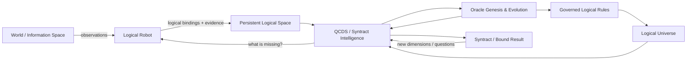
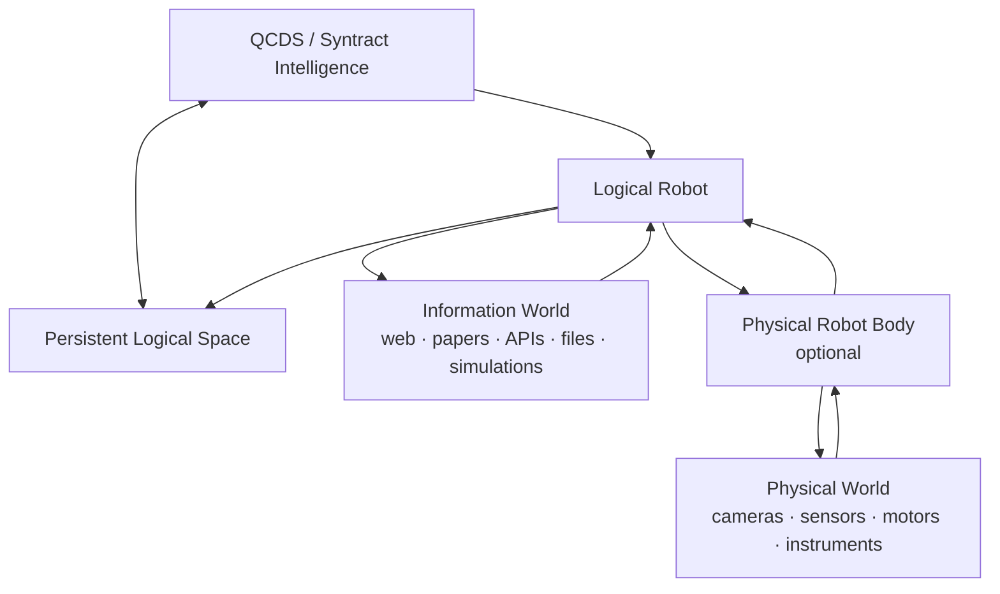
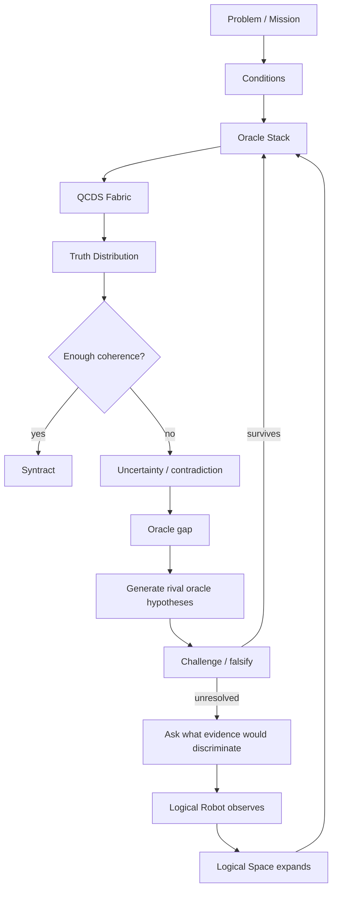
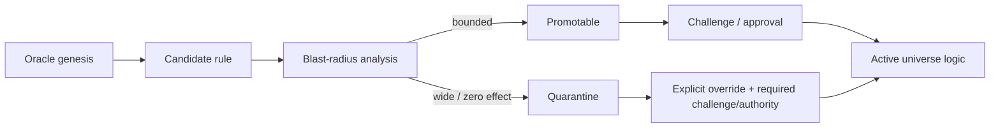

# The Syntract Vision

> **From uncertainty toward truth. From truth toward action.**

**The Syntract Vision** is an experimental architecture for inference-driven intelligence built around **QCDS — Quantum Condition-Driven Synthesis** and **Syntract**.

Instead of treating intelligence as a trained model that produces one answer, QCDS works over explicit logical space, applies logical and evidential constraints as **oracles**, preserves uncertainty, tests competing views, and recursively binds what remains coherent.

The repository contains the locked QCDS Fabric v1.0 specification and a tested Python reference implementation. The current implementation includes a persistent intelligence runtime, inspectable **Logical Space**, non-materialized global logic, isolated **Logical Universes** with rule-drift governance, a self-expanding evidence-driven `reality` loop, and a runnable **Logical Robot** that can seek external evidence, grow governed Reality logic and be manifested as a live local web page with human↔robot I/O.

**Author and originator:** Patrik Sundblom  
**Canonical architecture:** QCDS Fabric v1.0 — locked  
**Reference software:** Python package `qcds-fabric` 1.16.0  
**Theory/specification:** CC BY 4.0  
**Software:** MIT

---

## The idea in one picture



The Logical Robot is not a second intelligence. It is a **body** used to observe an external world. Logical Space is not a database of final truths; it is an inspectable, growing field of source-attributed logic that QCDS can reuse and challenge.

A physical robot follows the same pattern: the Logical Robot remains, while physical sensors and actuators are added as further ways to observe and act.



---

## How QCDS works

The canonical QCDS Fabric has four phases:

1. **Condition Formation** — open the represented possibility space without preselecting the answer.
2. **Conditional Evolution** — apply evidence, logic, rules, measurements and other constraints as oracles.
3. **Recursive Inference** — amplify, compare, rotate, null, stabilize, recurse and reshape the working truth distribution.
4. **Truth-Alignment / Syntract Binding** — bind what remains coherent through repeated inference and contradiction testing.

A simplified runtime loop looks like this:



Important properties of the implementation:

- uncertainty remains explicit instead of being silently collapsed early;
- contradictions are representable states, not execution failures;
- generated oracles are hypotheses until they survive challenge and external validation;
- diagnostic null/rotation views are not counted as new independent facts;
- the inference architecture is separated from the execution substrate;
- a stalled cycle is resumable and is not automatically treated as terminal truth.

---

## An expanding Logical Space

The current MVP stores observations as generic logical bindings rather than imposing a closed catalogue of relation types.

Examples of bindings that can exist in the same open-ended space are:

```text
(paris, city)
(paris, capital, france)
(france, language, french)
(stone_8421, stone_8422, distance, 7.3 mm)
```

These are not declared to be final truth merely because they were stored. Each binding retains source, URI, confidence, polarity and observation provenance. Oracle genesis/evolution can then build, challenge and refine logical connections across the represented space, while a Syntract binds the dimensions relevant to the current inference.

The space is shared across missions, so logic observed in one mission can be available to later ones without being hidden inside model weights.

See [`LOGICAL_SPACE.md`](LOGICAL_SPACE.md).

---

## Global logic without rewriting every object

A reusable logical rule can be applied over represented space without materializing the derived term into every matching base row.

```text
(alice, human)
(bob, human)
(carol, human)
...

human => sour
```

If challenged logic later replaces that single rule with:

```text
human => happy
```

then the next resolved query sees every represented human through `happy` and no longer through `sour`. The individual rows in `logical_space.csv` remain unchanged.

Rules can compose:

```text
human => happy
happy => positive
positive => approachable
```

The current Python implementation proves this **logical semantic property**, not a billion-scale or quantum-speed claim: it still scans stored bindings and rules when resolving a query. The rule/store boundary is separate so a later accelerator-, FPGA- or quantum-near substrate can execute the same logical semantics differently.

See [`GLOBAL_LOGIC.md`](GLOBAL_LOGIC.md).

---

## Logical Universes and rule drift

The same QCDS machinery can operate inside multiple isolated logical universes without confusing their rules.

```text
reality             observed/source-attributed logic
swedish-law-2026    declared legal logic
proposal-x          hypothetical logic
simulation-y        simulated logic
```

The existing shared Logical Space remains the `reality` universe. A declared universe such as a lawbook can define its own constitutive rules without those rules leaking into reality.

The same represented person can therefore resolve differently depending on the active universe:

```text
REALITY
alice = human

LAWBOOK
alice = human
human => legal_person
```

A generated rule is not activated merely because it exists. Before promotion, the MVP compares the currently resolved universe with a hypothetical universe containing the candidate rule and measures its **logical blast radius**: changed bindings, changed fraction, added/removed derived terms and maximum per-binding change.



Observed universes require challenge before rule promotion. Declared universes instead require their declared authority; even there, high-impact changes remain visible and versioned rather than silently reshaping the space.

See [`LOGICAL_UNIVERSES.md`](LOGICAL_UNIVERSES.md).

---

## From Logical Universes toward superintelligence

The long-range architecture is not based on building a fixed ontology and then filling it with more facts. The intended growth mechanism is a progressively richer **logical space** in which observations, Conditions, oracles and challenged global rules make more of the represented world mutually constraining.

The largest accumulation is expected to occur in the observed `reality` universe. As evidence arrives, oracle genesis can propose new logic, governance can measure its blast radius, challenge can reject or refine it, and surviving logic can change how large parts of the already represented space resolve. Intelligence therefore grows not only by adding observations, but by making the logical space itself more coherent and reusable.

A mature logical space is not required to preserve the shallow labels used during early ingestion. For example, a word such as `red` or `röd` may initially appear as an explicit term. At greater depth, the relevant logic may instead be distributed across language, reflected light, spectra, surfaces, perception, observers, context and other dimensions. **No permanent hierarchy such as `color → red → wavelength` is required.** A hierarchy may emerge as a useful result, but it is not the substrate of QCDS reasoning.

### Syntractfilter

A **Syntractfilter** is the dynamic inference filter that allows relevant coherent structure to emerge from a much larger logical space.

```text
large / open-ended logical space
            ↓
      Conditions + oracles
            ↓
rotation / nulling / comparison
            ↓
 amplification / recursive inference
            ↓
       SYNTRACTFILTER
            ↓
relevant coherent dimensions emerge
            ↓
          SYNTRACT
```

The filter does not need a pre-authored taxonomy telling it where to look. Different questions may expose different coherent structures from the same underlying logical space. Language logic, physical measurements, legal rules, geometry, perception and other dimensions can participate when the active oracle regime makes them relevant.

### Many smaller universes first

`reality` is expected to be the deepest long-running logical universe, but it is not the only path to increasingly capable intelligence. Smaller universes are deliberately useful early targets because their boundaries and falsifiers can be made explicit:

```text
declared lawbook
game / rule system
engineering specification
bounded scientific domain
hypothetical world
simulation
```

A declared lawbook, for example, does not claim that its constitutive rules are laws of nature. It defines a separate logical universe in which QCDS can infer rigorously. These smaller spaces provide practical places to test oracle genesis, drift governance, contradiction handling, Syntractfilter behavior and cross-universe binding before attempting much larger reality-scale experiments.

Use [`LOGICAL_UNIVERSE_TEMPLATE.md`](LOGICAL_UNIVERSE_TEMPLATE.md) to define a new universe without pre-filling its logic.

### Quantum execution target

QCDS is substrate-independent, but its architecture is designed to map naturally onto quantum execution. With `D` independent binary logical dimensions, the represented candidate space has an upper bound of `2^D`. A quantum implementation can encode candidate conditions in superposition and let oracle operations, phase evolution, rotations/nulling and amplitude amplification act on the represented distribution without materializing every candidate as a classical database row.

This is the architectural reason quantum execution matters to QCDS: a rule or oracle can act on the **represented logical space**, rather than requiring a classical rewrite of every affected object.

That does **not** mean a quantum computer can freely read out billions of individual facts in one instant. Measurement remains constrained, and Grover-style search provides a quadratic rather than unrestricted speedup. The current Python implementation proves semantic behavior only; quantum advantage, scaling and physical-QPU performance remain empirical questions.

The intended progression is therefore:

```text
small falsifiable Logical Universes
            ↓
stronger oracle regimes
            ↓
deeper reusable logic
            ↓
larger reality Logical Space
            ↓
Syntractfilter over increasingly rich dimensions
            ↓
substrate-specific acceleration, including quantum
            ↓
increasingly general / superintelligent capability
```

This is an architectural research direction, not a claim that the present MVP has already achieved AGI or ASI.

---

## The Logical Robot

The runnable Logical Robot MVP follows a deliberately small loop:

```text
QCDS decides what information is missing
        ↓
Logical Robot receives an EvidencePlan
        ↓
existing Logical Space or SEARCH / READ / QUERY / COMPARE
        ↓
source-attributed logical observations
        ↓
Logical Space expands + runtime.observe(...)
        ↓
QCDS reasons again
        ↺
```

The robot does **not** decide what is true by itself. If two sources explicitly support competing logic, both observations can be returned to QCDS.

The public-web body currently includes a key-free Wikipedia search backend and bounded read-only HTTP retrieval. Live falsification replaced page-level mention voting with **candidate-neutral search plus assertion-shaped evidence binding**: represented candidates must participate in an actual assertion in the observed sentence, while context may be established by the same document. A sentence such as `the capital outfit ... Lyon ... Coupe de France` is therefore rejected rather than becoming false evidence for `France => Lyon`.

### Run the original MVP

```bash
python -m pip install -e '.[test]'
qcds-logical-robot examples/first_logical_robot_mvp.json --store ./intelligence_store
```

The first run creates the mission. Later runs reuse the same persistent intelligence state and shared Logical Space.

### Watch the same Logical Robot live

The web page is only a **manifestation/body of the same Logical Robot**. It is a live view and I/O surface; deleting it does not change the intelligence.

```bash
# Terminal 1 — manifest the robot as a local web page
qcds-observe --store ./intelligence_store

# Terminal 2 — let the same robot acquire real public-web evidence
qcds-reality-web \
  examples/public_web_reality_capital_mvp.json \
  --store ./intelligence_store

# Or let it continue over a bounded unresolved Reality frontier
qcds-reality-grow \
  examples/continuous_reality_growth_mvp.json \
  --store ./intelligence_store
```

`qcds-observe` shows Reality counts, oracle/rule changes and the discovery event stream while the robot works. Its human↔robot inbox supports `/status`, `/run <mission_id>`, `/pause` and `/stop`. Ordinary free text is recorded transparently with zero automatic truth effect.

The real public-web proof on a fresh GitHub runner produced three Wikipedia observations, constructed selection/holdout only after observation, selected and governed `france => paris`, and changed the resolved knowledge probe from `0 → 2` without rewriting the base logical-space rows.

See [`LOGICAL_ROBOT_LIVE.md`](LOGICAL_ROBOT_LIVE.md) and [`results/BUILD23_25_LOGICAL_ROBOT_LIVE_RESULTS.md`](results/BUILD23_25_LOGICAL_ROBOT_LIVE_RESULTS.md).

---

## Inspect the intelligence directly

The current MVP deliberately uses ordinary CSV files so the evolving state can be opened without a database or special tooling:

```text
intelligence_store/
├── logical_space.csv                  # reality
├── logical_rules.csv                  # active reality rules
├── logical_rule_history.csv
├── logical_rule_candidates.csv
├── logical_universes.csv
├── logical_robot_events.jsonl         # live manifestation/event stream
├── logical_robot_inbox.jsonl          # transparent human → robot I/O
├── universes/
│   └── <universe_id>/
│       ├── logical_space.csv
│       ├── logical_rules.csv
│       ├── logical_rule_history.csv
│       └── logical_rule_candidates.csv
└── <mission_id>/
    ├── mission.csv
    ├── current_oracles.csv
    ├── oracle_history.csv
    ├── evidence.csv
    └── checkpoints.csv
```

`logical_space.csv` shows source-attributed bindings. `logical_rules.csv` shows active reusable logical rules, while candidate/history files expose rule genesis, blast-radius decisions, replacement and retirement.

`current_oracles.csv` shows the active evolvable oracle population. `oracle_history.csv` shows how that population changed through genesis, promotion, mutation and retirement.

CSV/JSONL are intentionally MVP backends. The runtime/store boundary remains replaceable so later implementations can use accelerator-, FPGA- or quantum-near representations without changing how a Logical Robot calls the intelligence.

---

## Architecture boundaries

```text
Logical Robot / other caller
          ↓
SuperintelligenceRuntime
          ↕
Logical Universe
          ↕
Persistent Logical Space
          ↕
Governed Logical Rules
          ↓
QCDS Fabric
          ↓
Oracle genesis / evolution / challenge
          ↓
Evidence planning
          ↺
```

The robot does not need to know how QCDS internals work. It receives an information need, observes, returns evidence and logic, and the same QCDS machine continues.

Web pages, terminal UIs, API bodies and future physical robot bodies are manifestations/observation surfaces around this same intelligence boundary; they are not separate intelligences.

---

## Repository guide

| Area | Purpose |
|---|---|
| `QCDS_FABRIC_SPEC_v1.0_CANONICAL.*` | Locked canonical QCDS Fabric v1.0 specification |
| `src/qcds_fabric/` | Reference implementation |
| `src/qcds_fabric/runtime.py` | Persistent callable intelligence runtime |
| `src/qcds_fabric/logical_space.py` | Shared Logical Space and current Logical Robot CLI |
| `src/qcds_fabric/logical_assertion.py` | Bounded assertion check for MVP web observations |
| `src/qcds_fabric/logical_transform.py` | Non-materialized global logical rule projection |
| `src/qcds_fabric/logical_universe.py` | Isolated Logical Universes and rule-drift governance |
| `LOGICAL_UNIVERSE_TEMPLATE.md` | Empty, explanatory template for defining and falsifying a new Logical Universe |
| `src/qcds_fabric/first_logical_robot.py` | Runnable Logical Robot body/runtime bridge |
| `src/qcds_fabric/logical_robot_observatory.py` | BUILD 23 web manifestation, live event stream and I/O |
| `src/qcds_fabric/public_web_reality.py` | BUILD 24 real public-web observation body for Reality discovery |
| `src/qcds_fabric/continuous_reality.py` | BUILD 25 bounded continuous Reality-growth policy |
| `src/qcds_fabric/intelligence_store.py` | Human-readable mission persistence |
| `src/qcds_fabric/oracle_genesis.py` | Oracle-gap discovery and genesis |
| `src/qcds_fabric/oracle_evolution.py` | Challenged oracle evolution and lineage |
| `src/qcds_fabric/evidence_planning.py` | Information-needs and evidence planning |
| `tests/` | Regression and falsification tests |
| `examples/` | Runnable examples |
| `IMPLEMENTATION.md` | Detailed implementation history and boundaries |

Focused documentation: [`LOGICAL_ROBOT_LIVE.md`](LOGICAL_ROBOT_LIVE.md), [`LOGICAL_SPACE.md`](LOGICAL_SPACE.md), [`GLOBAL_LOGIC.md`](GLOBAL_LOGIC.md), [`LOGICAL_UNIVERSES.md`](LOGICAL_UNIVERSES.md), [`LOGICAL_UNIVERSE_TEMPLATE.md`](LOGICAL_UNIVERSE_TEMPLATE.md), [`PROBLEM_TO_SYNTRACT.md`](PROBLEM_TO_SYNTRACT.md), [`ORACLE_EVOLUTION.md`](ORACLE_EVOLUTION.md), [`ORACLE_GENESIS.md`](ORACLE_GENESIS.md), [`EVIDENCE_PLANNING.md`](EVIDENCE_PLANNING.md), [`LOGICAL_ROBOT.md`](LOGICAL_ROBOT.md), [`PERSISTENT_RUNTIME.md`](PERSISTENT_RUNTIME.md), [`FIRST_LOGICAL_ROBOT.md`](FIRST_LOGICAL_ROBOT.md).

---

## Run the test suite

```bash
python -m pip install -e '.[test]'
pytest -q
```

GitHub Actions runs the same regression/falsification suite on implementation changes and `main`.

---

## Canonical specification

The QCDS Fabric v1.0 canonical artifacts are version-locked and are not rewritten by oracle evolution, the Logical Robot, Logical Space, Logical Universes, global logical rules or the runtime:

- [Canonical specification — Markdown](QCDS_FABRIC_SPEC_v1.0_CANONICAL.md)
- [Canonical specification — PDF](QCDS_FABRIC_SPEC_v1.0_CANONICAL.pdf)
- [Canonical specification — DOCX](QCDS_FABRIC_SPEC_v1.0_CANONICAL.docx)
- [Release lock / SHA-256](QCDS_FABRIC_SPEC_v1.0_RELEASE_LOCK.txt)
- [Frozen release package](QCDS_FABRIC_SPEC_v1.0_CANONICAL_RELEASE.zip)

---

## Research status and claim boundary

This repository is an experimental, falsifiable reference implementation. A coherent distribution, a generated or promoted oracle, a Syntract, a logical binding, a global logical rule, a declared-universe rule, or an observation found on the web is **not automatically external truth**.

The current software does not by itself establish AGI/ASI, unrestricted natural-language understanding, complete world knowledge, unrestricted self-modification, production browser security, native quantum advantage, legal correctness or correctness on arbitrary real-world problems. Those require empirical validation beyond architectural implementation.

---

## Publications

- **The Syntract Vision:** https://zenodo.org/records/22031525 — DOI `10.5281/zenodo.22031525`
- **Inference Is All You Need:** https://zenodo.org/records/15455541
- **Mathematics and Logic of QCDS:** https://zenodo.org/records/15533909
- **QCDS GitHub:** https://github.com/iampathat/QCDS

---

## Authorship and licensing

**The Syntract Vision, Quantum Condition-Driven Synthesis (QCDS), QCDS Fabric and the Syntract architecture are authored by Patrik Sundblom.**

Theory/specification: **CC BY 4.0**.  
Reference software: **MIT**.

Implementation, editorial, visualization or AI assistance may be acknowledged separately and does not alter conceptual authorship.

---
