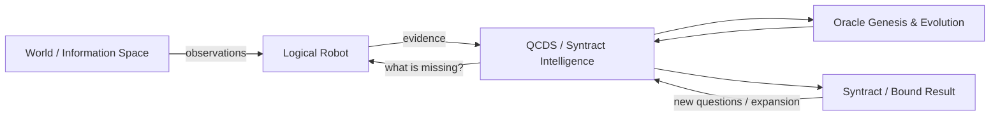
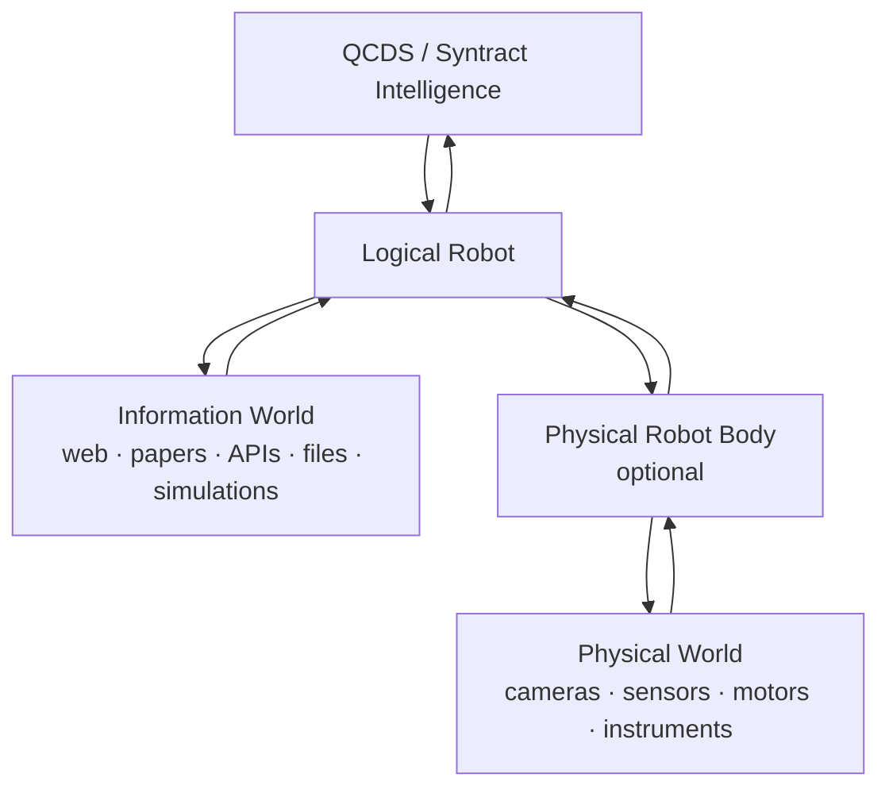
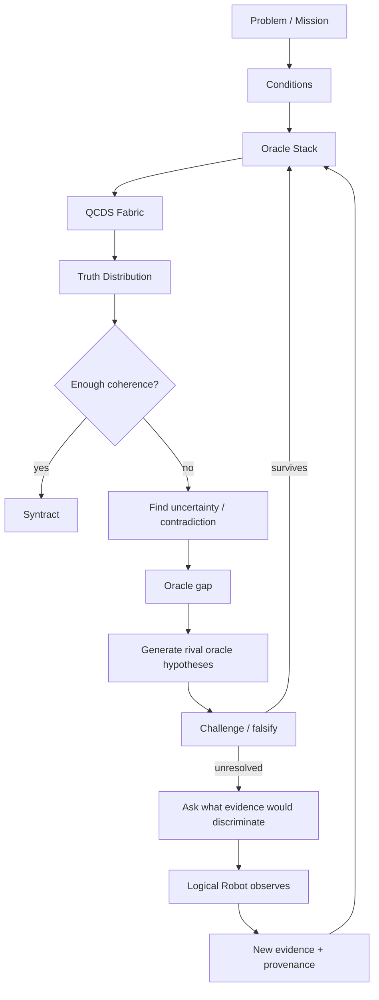

# The Syntract Vision

> **From uncertainty toward truth. From truth toward action.**

**The Syntract Vision** is an experimental architecture for inference-driven intelligence built around **QCDS — Quantum Condition-Driven Synthesis** and **Syntract**.

Instead of treating intelligence as a trained model that produces one answer, QCDS works over an explicit space of possible conditions, applies logical and evidential constraints as **oracles**, preserves uncertainty, tests competing views, and recursively binds what remains coherent.

The repository contains the locked QCDS Fabric v1.0 specification and a tested Python reference implementation. The current implementation also includes a persistent intelligence runtime and a first runnable **Logical Robot** that can seek external evidence and return it to the same QCDS reasoning loop.

**Author and originator:** Patrik Sundblom  
**Canonical architecture:** QCDS Fabric v1.0 — locked  
**Reference software:** Python package `qcds-fabric` 1.7.0  
**Theory/specification:** CC BY 4.0  
**Software:** MIT

---

## The idea in one picture



The Logical Robot is not a second intelligence. It is a **body** that the intelligence can use to observe an external world.

A physical robot follows the same pattern: the Logical Robot remains, while physical sensors and actuators are added as further ways to observe and act.



---

## How QCDS works

The canonical QCDS Fabric has four phases:

1. **Condition Formation** — open the represented possibility space without preselecting the answer.
2. **Conditional Evolution** — apply evidence, logic, rules, measurements and other constraints as oracles.
3. **Recursive Inference** — amplify, compare, rotate, null, stabilize, recurse and reshape the working truth distribution.
4. **Truth-Alignment / Syntract Binding** — bind what remains coherent through repeated inference and contradiction testing.

A simplified runtime loop looks like this:



Important properties of the implementation:

- uncertainty remains explicit instead of being silently collapsed early;
- contradictions are representable states, not execution failures;
- generated oracles are hypotheses until they survive challenge and external validation;
- diagnostic null/rotation views are not counted as new independent facts;
- the inference architecture is separated from the execution substrate;
- a stalled cycle is resumable and is not automatically treated as terminal truth.

---

## The first Logical Robot

The repository now includes a runnable Logical Robot MVP. Its job is deliberately simple:

```text
QCDS decides what information is missing
        ↓
Logical Robot receives an EvidencePlan
        ↓
SEARCH / READ / QUERY / COMPARE
        ↓
source-attributed observations
        ↓
runtime.observe(...)
        ↓
QCDS reasons again
        ↺
```

The robot does **not** decide what is true by itself. If two sources disagree, both observations can be returned to QCDS as separate evidence.

The first public-web body includes:

- a key-free Wikipedia search backend;
- bounded read-only HTTP retrieval;
- explicit source provenance;
- deterministic extraction over candidates already represented in the logical problem space;
- duplicate-evidence protection across restart/resume.

### Run the MVP

```bash
python -m pip install -e '.[test]'
qcds-logical-robot examples/first_logical_robot_mvp.json --store ./intelligence_store
```

The first run creates the mission. Later runs reuse the same persistent intelligence state.

For details, see [`FIRST_LOGICAL_ROBOT.md`](FIRST_LOGICAL_ROBOT.md).

---

## Inspect the intelligence directly

The current MVP deliberately stores its evolving logical state in ordinary CSV files so it can be opened and inspected without a database or special tooling:

```text
intelligence_store/
└── <mission_id>/
    ├── mission.csv
    ├── current_oracles.csv
    ├── oracle_history.csv
    ├── evidence.csv
    └── checkpoints.csv
```

`current_oracles.csv` shows the active evolvable oracle population: rule topology, logical transform, confidence, source and persistent stack version.

`oracle_history.csv` shows how that population changed through genesis, promotion, mutation and retirement.

This CSV backend is intentionally an MVP choice. The runtime/store boundary is separate so later implementations can use faster or hardware-near representations — including accelerator, FPGA or quantum-oriented execution — without changing how a Logical Robot calls the intelligence.

See [`PERSISTENT_RUNTIME.md`](PERSISTENT_RUNTIME.md).

---

## Architecture boundaries

The implementation is intentionally modular:

```text
Logical Robot / other caller
          ↓
SuperintelligenceRuntime
          ↓
Semantic problem representation
          ↓
QCDS Fabric
          ↓
Oracle genesis / evolution / challenge
          ↓
Evidence planning
          ↓
Persistent intelligence store
```

The robot does not need to know how QCDS internals work. It calls the runtime, receives an information need, returns observations, and calls the runtime again.

That same boundary is intended to support multiple logical robots and, later, physical robot bodies without rebuilding the intelligence core.

---

## Repository guide

| Area | Purpose |
|---|---|
| `QCDS_FABRIC_SPEC_v1.0_CANONICAL.*` | Locked canonical QCDS Fabric v1.0 specification |
| `src/qcds_fabric/` | Reference implementation |
| `src/qcds_fabric/runtime.py` | Persistent callable intelligence runtime |
| `src/qcds_fabric/first_logical_robot.py` | First runnable Logical Robot |
| `src/qcds_fabric/intelligence_store.py` | Human-readable persistence backend |
| `src/qcds_fabric/oracle_genesis.py` | Oracle-gap discovery and genesis |
| `src/qcds_fabric/oracle_evolution.py` | Challenged oracle evolution and lineage |
| `src/qcds_fabric/evidence_planning.py` | Information-needs and evidence planning |
| `tests/` | Regression and falsification tests |
| `examples/` | Runnable examples |
| `IMPLEMENTATION.md` | Detailed implementation history and boundaries |

More focused documentation:

- [`PROBLEM_TO_SYNTRACT.md`](PROBLEM_TO_SYNTRACT.md) — multi-query problem compilation
- [`ORACLE_EVOLUTION.md`](ORACLE_EVOLUTION.md) — challenged oracle evolution
- [`ORACLE_GENESIS.md`](ORACLE_GENESIS.md) — discovery of missing oracle structure
- [`EVIDENCE_PLANNING.md`](EVIDENCE_PLANNING.md) — autonomous evidence/experiment planning
- [`LOGICAL_ROBOT.md`](LOGICAL_ROBOT.md) — Logical Robot contract
- [`PERSISTENT_RUNTIME.md`](PERSISTENT_RUNTIME.md) — persistent runtime and CSV intelligence store
- [`FIRST_LOGICAL_ROBOT.md`](FIRST_LOGICAL_ROBOT.md) — runnable Logical Robot MVP

---

## Run the test suite

```bash
python -m pip install -e '.[test]'
pytest -q
```

GitHub Actions runs the same regression/falsification suite on implementation changes and `main`.

---

## Canonical specification

The QCDS Fabric v1.0 canonical artifacts are version-locked and are not rewritten by oracle evolution, the Logical Robot or the runtime:

- [Canonical specification — Markdown](QCDS_FABRIC_SPEC_v1.0_CANONICAL.md)
- [Canonical specification — PDF](QCDS_FABRIC_SPEC_v1.0_CANONICAL.pdf)
- [Canonical specification — DOCX](QCDS_FABRIC_SPEC_v1.0_CANONICAL.docx)
- [Release lock / SHA-256](QCDS_FABRIC_SPEC_v1.0_RELEASE_LOCK.txt)
- [Frozen release package](QCDS_FABRIC_SPEC_v1.0_CANONICAL_RELEASE.zip)

---

## Research status and claim boundary

This repository is an experimental, falsifiable reference implementation. A coherent distribution, a generated or promoted oracle, a Syntract, or an observation found on the web is **not automatically external truth**.

The current software does not by itself establish AGI/ASI, unrestricted autonomous causal discovery, unrestricted self-modification, production browser security, native quantum advantage or correctness on arbitrary real-world problems. Those require empirical validation beyond architectural implementation.

---

## Publications

- **The Syntract Vision:** https://zenodo.org/records/22031525 — DOI `10.5281/zenodo.22031525`
- **Inference Is All You Need:** https://zenodo.org/records/15455541
- **Mathematics and Logic of QCDS:** https://zenodo.org/records/15533909
- **QCDS GitHub:** https://github.com/iampathat/QCDS

---

## Authorship and licensing

**The Syntract Vision, Quantum Condition-Driven Synthesis (QCDS), QCDS Fabric and the Syntract architecture are authored by Patrik Sundblom.**

Theory/specification: **CC BY 4.0**.  
Reference software: **MIT**.

Implementation, editorial, visualization or AI assistance may be acknowledged separately and does not alter conceptual authorship.

---

**Welcome to the end of the beginning.**
