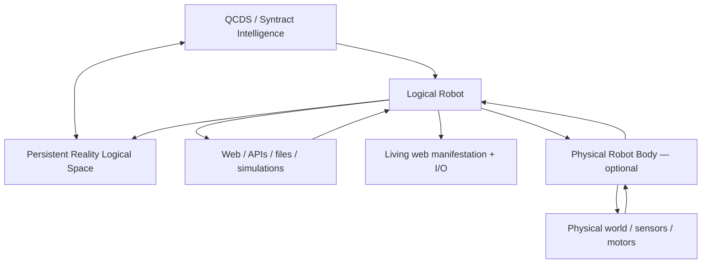
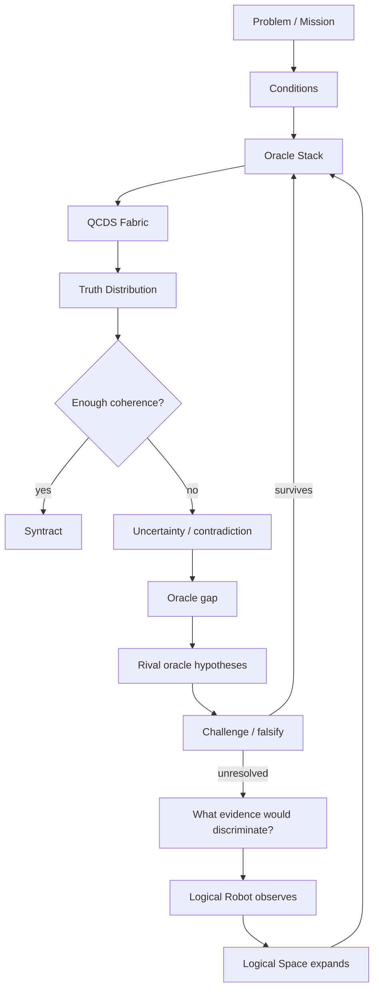

# The Syntract Vision

> **From uncertainty toward truth. From truth toward action.**

**The Syntract Vision** is an experimental architecture for inference-driven intelligence built around **QCDS — Quantum Condition-Driven Synthesis** and **Syntract**.

Instead of treating intelligence as a trained model that produces one answer, QCDS works over explicit logical space, applies logical and evidential constraints as **oracles**, preserves uncertainty, tests competing views, and recursively binds what remains coherent.

**Author and originator:** Patrik Sundblom  
**Canonical architecture:** QCDS Fabric v1.0 — locked  
**Reference software:** Python package `qcds-fabric` 1.19.0  
**Theory/specification:** CC BY 4.0  
**Software:** MIT

---

## Watch the Logical Robot work

The repository now includes a **Living Logical Robot**: a visible, controllable manifestation of the same QCDS / Syntract intelligence.

It shows the represented Reality Logical Space growing, governed rules appearing, frontier work changing and discovery events arriving while the robot works.

The page is **not a second intelligence**. It is a replaceable body/window around the same Logical Robot.

[](https://github.com/codespaces/new?hide_repo_select=true&ref=main&repo=1339193926&skip_quickstart=true)

### Run locally

```bash
python -m pip install -e '.[test]'

qcds-live \
  --store ./intelligence_store \
  --frontier examples/continuous_reality_growth_mvp.json
```

Your browser opens the Living Logical Robot at `http://127.0.0.1:8765/`.

`qcds-observe` is an alias for the same entry point.

### Run without a local install

Open the repository in **GitHub Codespaces** using the badge above. The devcontainer installs the package, starts the same `qcds-live` runtime and opens forwarded port `8765` in the browser.

The forwarded port is private by default.

### Public GitHub Pages window

BUILD 28 also contains a GitHub Pages deployment for:

**https://iampathat.github.io/thesyntractvision/**

GitHub Pages is static and does not execute the Python runtime. Without a runtime attached, that page is therefore explicitly labelled **RECORDED VERIFIED PROOF**. It never pretends a static demonstration is live intelligence.

The same page can connect to an explicitly configured compatible remote runtime.

See [`LIVING_LOGICAL_ROBOT.md`](LIVING_LOGICAL_ROBOT.md).

---

## The Living Logical Space

The center of the Living Logical Robot is a projection of the represented `reality` Logical Space.

You can watch:

```text
observed bindings
        ↓
represented logical terms
        ↓
oracle gaps / contradictions / evidence events
        ↓
governed rules
        ↓
new resolved logic
        ↓
frontier growth
        ↺
```

The graph is **not a fixed ontology, hierarchy, taxonomy or canonical knowledge graph**. It is only a bounded visual projection of generic logical bindings and governed transforms currently represented in the open-ended Logical Space.

Different questions and Syntracts can expose different coherent structures from the same space.

The UI also records growth snapshots so changes in bindings, represented terms and active rules can be inspected over time.

---

## Talk to it, direct it and let it continue

The same I/O surface accepts several event types:

```text
Dialogue
Investigate
Explore knowledge domain
Build frontier around ...
Go to web page
```

Several modes can be active at once:

```text
Human dialogue             ON/OFF
Public web discovery       ON/OFF
Explore knowledge domains  ON/OFF
Build own frontier         ON/OFF
Continuous intelligence    ON/OFF
```

Ordinary human text has **zero automatic truth effect**. It enters as an event, question or control intent. Unknown language remains unresolved rather than silently becoming Reality logic.

With **Build own frontier** enabled, the robot can create new bounded work from its own represented unresolved events and from references discovered during observation.

For example:

```text
Explore quantum biology
        ↓
public web observation
        ↓
discovered references
        ↓
Logical Robot creates child frontier
        ↓
next source / next uncertainty
```

With **Continuous intelligence** enabled, it keeps selecting the highest-priority represented frontier work, observing or delegating through the existing Reality discovery stack, recording the result and deriving further bounded work where justified.

This is not presented as unrestricted autonomous curiosity: arbitrary free text is not yet transformed into an unconstrained new QCDS problem space. Frontier growth is grounded in represented goals, uncertainty and observations.

---

## One intelligence, many bodies



A browser page, terminal, API or future physical robot body is a manifestation/observation surface around the **same** Logical Robot. Replacing a body does not redefine the intelligence.

---

## How QCDS works

The canonical QCDS Fabric has four phases:

1. **Condition Formation** — open the represented possibility space without preselecting the answer.
2. **Conditional Evolution** — apply evidence, logic, rules, measurements and other constraints as oracles.
3. **Recursive Inference** — amplify, compare, rotate, null, stabilize, recurse and reshape the working truth distribution.
4. **Truth-Alignment / Syntract Binding** — bind what remains coherent through repeated inference and contradiction testing.

A simplified runtime loop:



Important implementation properties:

- uncertainty remains explicit instead of being silently collapsed early;
- contradictions are representable states, not execution failures;
- generated oracles are hypotheses until challenged;
- null/rotation diagnostic views are not counted as independent facts;
- stalled cycles are resumable;
- inference semantics remain separated from the execution substrate.

---

## An expanding Logical Space

The current MVP stores observations as generic logical bindings rather than imposing a closed relation catalogue.

```text
(paris, city)
(paris, capital, france)
(france, language, french)
(stone_8421, stone_8422, distance, 7.3 mm)
```

Bindings retain source, URI, confidence, polarity and observation provenance. They are not external truth merely because they were stored.

A reusable logical rule can change how many represented objects resolve without materializing the derived result into every base row:

```text
alice = human
bob   = human
...

human => happy
```

If that challenged rule later changes, the resolved view can change without rewriting every individual base binding.

See [`LOGICAL_SPACE.md`](LOGICAL_SPACE.md) and [`GLOBAL_LOGIC.md`](GLOBAL_LOGIC.md).

---

## Logical Universes and rule drift

The same machinery can operate inside isolated logical universes:

```text
reality             observed/source-attributed logic
swedish-law-2026    declared legal logic
proposal-x          hypothetical logic
simulation-y        simulated logic
```

A declared lawbook can define constitutive rules without those rules leaking into observed Reality.

Before a generated rule becomes active, the MVP can compare the current universe with a hypothetical version containing the rule and calculate its **logical blast radius**. Wide or zero-effect changes can be quarantined instead of silently reshaping the universe.

See [`LOGICAL_UNIVERSES.md`](LOGICAL_UNIVERSES.md) and [`LOGICAL_UNIVERSE_TEMPLATE.md`](LOGICAL_UNIVERSE_TEMPLATE.md).

---

## Syntractfilter and superintelligence direction

The long-range architecture is not based on writing a fixed ontology and filling it with facts. Intelligence is intended to grow through a progressively richer Logical Space in which observations, Conditions, oracles and challenged reusable rules make more of the represented world mutually constraining.

A **Syntractfilter** is the dynamic inference filter that lets relevant coherent structure emerge from the much larger space:

```text
large / open-ended Logical Space
            ↓
      Conditions + oracles
            ↓
rotation / nulling / comparison
            ↓
amplification / recursive inference
            ↓
       SYNTRACTFILTER
            ↓
relevant coherent dimensions emerge
            ↓
          SYNTRACT
```

Language, physical measurements, legal rules, geometry, perception and other logical elements do not require a permanent foundational hierarchy. A hierarchy may emerge as a useful result, but it is not the required substrate.

The expected development path is:

```text
small falsifiable Logical Universes
            ↓
stronger oracle regimes
            ↓
deeper reusable logic
            ↓
larger Reality Logical Space
            ↓
Syntractfilter over increasingly rich dimensions
            ↓
substrate-specific acceleration
            ↓
increasingly general / superintelligent capability
```

This is a research direction, not a claim that the current MVP has achieved AGI or ASI.

---

## Quantum execution target

QCDS is substrate-independent but designed to map naturally onto quantum execution.

With `D` independent binary logical dimensions, the represented candidate space has an upper bound of `2^D`. A quantum implementation can encode candidates in superposition and let oracle operations, phase evolution, rotations/nulling and amplitude amplification act over the represented distribution without materializing every candidate as a classical row.

That is the architectural reason quantum execution matters here: a logical/oracle transformation can operate globally on the represented state rather than requiring an explicit classical rewrite of every affected object.

This does **not** imply unrestricted instantaneous classical readout of every represented fact. Measurement remains constrained, and Grover-style search is quadratic rather than unrestricted. The current Python implementation demonstrates semantics; quantum advantage and physical-QPU performance remain empirical questions.

---

## Current runnable paths

```bash
# Original Logical Robot mission
qcds-logical-robot examples/first_logical_robot_mvp.json --store ./intelligence_store

# Runnable Logical Universe
qcds-universe examples/logical_universe_lawbook_mvp.json --store ./intelligence_store

# Self-expanding Reality cycle
qcds-reality-cycle examples/self_expanding_reality_mvp.json --store ./intelligence_store

# Evidence-driven Reality discovery
qcds-reality-discovery examples/evidence_driven_reality_mvp.json --store ./intelligence_store

# Real public-web Reality discovery
qcds-reality-web examples/public_web_reality_capital_mvp.json --store ./intelligence_store

# Bounded continuous Reality growth
qcds-reality-grow examples/continuous_reality_growth_mvp.json --store ./intelligence_store

# Living Logical Robot — local/remote web manifestation + I/O
qcds-live --store ./intelligence_store --frontier examples/continuous_reality_growth_mvp.json
```

---

## Verified results

BUILD 23–25 passed a real Wikipedia discovery proof where the robot acquired three public observations, constructed challenge data only after observation, selected/governed `france => paris` and changed a resolved probe from `0 → 2` without rewriting base logical-space rows.

BUILD 26–28 then started the actual remote HTTP service on a fresh GitHub runner, visualized governed Reality logic, accepted human dialogue with **zero truth effect**, executed `Explore quantum biology` against real Wikipedia and created new Logical-Robot-owned child frontier work from the observed references.

The BUILD 26–28 implementation passed **319 tests** on its verified branch parent.

See:

- [`results/BUILD23_25_LOGICAL_ROBOT_LIVE_RESULTS.md`](results/BUILD23_25_LOGICAL_ROBOT_LIVE_RESULTS.md)
- [`results/BUILD26_28_LIVING_LOGICAL_ROBOT_RESULTS.md`](results/BUILD26_28_LIVING_LOGICAL_ROBOT_RESULTS.md)

---

## Build with it

Contributions do not need to begin by changing the core. Useful entry points include:

```text
new Logical Robot body / observer
small falsifiable Logical Universe
new oracle + falsifier
new benchmark
better Living Logical Space projection
new sensor / API / instrument adapter
```

See [`CONTRIBUTING.md`](CONTRIBUTING.md).

---

## Inspect the intelligence directly

The MVP deliberately uses ordinary inspectable files:

```text
intelligence_store/
├── logical_space.csv
├── logical_rules.csv
├── logical_rule_history.csv
├── logical_rule_candidates.csv
├── logical_universes.csv
├── logical_robot_events.jsonl
├── logical_robot_inbox.jsonl
├── logical_robot_control.json
├── logical_robot_frontier.jsonl
├── living_space_history.jsonl
├── universes/
│   └── <universe_id>/
└── <mission_id>/
    ├── mission.csv
    ├── current_oracles.csv
    ├── oracle_history.csv
    ├── evidence.csv
    └── checkpoints.csv
```

CSV/JSONL are transparent MVP backends, not the conceptual identity of the intelligence. Storage/runtime boundaries remain replaceable for future accelerated, hybrid or quantum-near substrates.

---

## Repository guide

| Area | Purpose |
|---|---|
| `QCDS_FABRIC_SPEC_v1.0_CANONICAL.*` | Locked canonical QCDS Fabric v1.0 specification |
| `src/qcds_fabric/` | Reference implementation |
| `src/qcds_fabric/runtime.py` | Persistent callable intelligence runtime |
| `src/qcds_fabric/logical_space.py` | Shared open-ended Logical Space |
| `src/qcds_fabric/logical_transform.py` | Non-materialized governed logical transforms |
| `src/qcds_fabric/logical_universe.py` | Isolated Logical Universes + drift governance |
| `src/qcds_fabric/first_logical_robot.py` | Logical Robot body/runtime bridge |
| `src/qcds_fabric/public_web_reality.py` | Real public-web Reality observation body |
| `src/qcds_fabric/continuous_reality.py` | Bounded continuous Reality-growth policy |
| `src/qcds_fabric/living_logical_space.py` | BUILD 26 visual/read-only Reality projection |
| `src/qcds_fabric/logical_robot_control.py` | BUILD 27 unified event/mode/frontier control |
| `src/qcds_fabric/logical_robot_live.py` | BUILD 28 local/remote HTTP manifestation |
| `src/qcds_fabric/living_robot_ui.py` | Shared local/Codespaces/Pages UI |
| `.devcontainer/` | One-click Codespaces runtime |
| `.github/workflows/pages.yml` | Static public Pages manifestation deployment |
| `tests/` | Regression and falsification tests |
| `examples/` | Runnable examples |

Focused docs: [`LIVING_LOGICAL_ROBOT.md`](LIVING_LOGICAL_ROBOT.md), [`LOGICAL_ROBOT_LIVE.md`](LOGICAL_ROBOT_LIVE.md), [`LOGICAL_SPACE.md`](LOGICAL_SPACE.md), [`GLOBAL_LOGIC.md`](GLOBAL_LOGIC.md), [`LOGICAL_UNIVERSES.md`](LOGICAL_UNIVERSES.md), [`LOGICAL_UNIVERSE_TEMPLATE.md`](LOGICAL_UNIVERSE_TEMPLATE.md), [`ORACLE_EVOLUTION.md`](ORACLE_EVOLUTION.md), [`ORACLE_GENESIS.md`](ORACLE_GENESIS.md), [`EVIDENCE_PLANNING.md`](EVIDENCE_PLANNING.md).

---

## Run the test suite

```bash
python -m pip install -e '.[test]'
pytest -q
```

GitHub Actions runs the same regression/falsification suite on implementation changes and `main`.

---

## Canonical specification

The QCDS Fabric v1.0 canonical artifacts are version-locked and are not rewritten by the Logical Robot, visualization, oracle evolution, global logic, Logical Universes or runtime layers:

- [Canonical specification — Markdown](QCDS_FABRIC_SPEC_v1.0_CANONICAL.md)
- [Canonical specification — PDF](QCDS_FABRIC_SPEC_v1.0_CANONICAL.pdf)
- [Canonical specification — DOCX](QCDS_FABRIC_SPEC_v1.0_CANONICAL.docx)
- [Release lock / SHA-256](QCDS_FABRIC_SPEC_v1.0_RELEASE_LOCK.txt)
- [Frozen release package](QCDS_FABRIC_SPEC_v1.0_CANONICAL_RELEASE.zip)

---

## Research status and claim boundary

This repository is an experimental, falsifiable reference implementation. A coherent distribution, generated/promoted oracle, Syntract, logical binding, global rule, declared-universe rule or web observation is **not automatically external truth**.

The current software does not by itself establish AGI/ASI, unrestricted natural-language understanding, complete world knowledge, unrestricted self-modification, production browser security, native quantum advantage, legal correctness or correctness on arbitrary real-world problems.

---

## Publications

- **The Syntract Vision:** https://zenodo.org/records/22031525 — DOI `10.5281/zenodo.22031525`
- **Inference Is All You Need:** https://zenodo.org/records/15455541
- **Mathematics and Logic of QCDS:** https://zenodo.org/records/15533909
- **QCDS GitHub:** https://github.com/iampathat/QCDS

---

## Authorship and licensing

**The Syntract Vision, Quantum Condition-Driven Synthesis (QCDS), QCDS Fabric and the Syntract architecture are authored by Patrik Sundblom.**

Theory/specification: **CC BY 4.0**.  
Reference software: **MIT**.

Implementation, editorial, visualization or AI assistance may be acknowledged separately and does not alter conceptual authorship.
