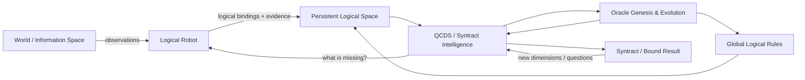
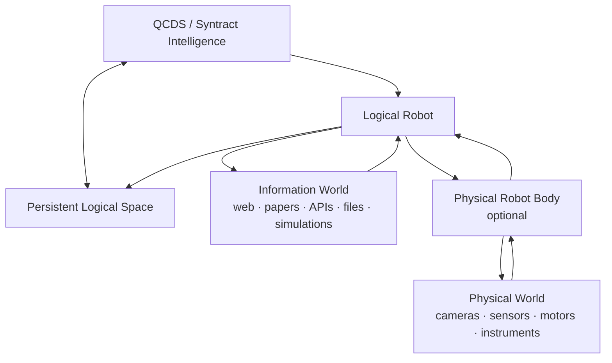
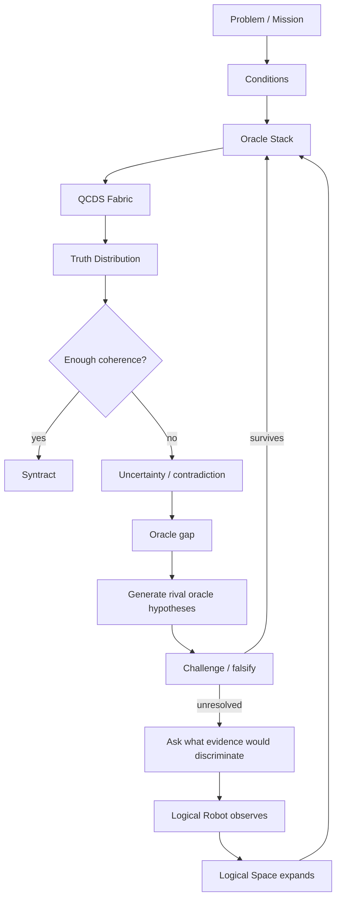

# The Syntract Vision

> **From uncertainty toward truth. From truth toward action.**

**The Syntract Vision** is an experimental architecture for inference-driven intelligence built around **QCDS — Quantum Condition-Driven Synthesis** and **Syntract**.

Instead of treating intelligence as a trained model that produces one answer, QCDS works over an explicit logical space, applies logical and evidential constraints as **oracles**, preserves uncertainty, tests competing views, and recursively binds what remains coherent.

The repository contains the locked QCDS Fabric v1.0 specification and a tested Python reference implementation. The current implementation includes a persistent intelligence runtime, a shared inspectable **Logical Space**, global non-materialized logical transforms, and a runnable **Logical Robot** that can seek external evidence and return it to the same QCDS reasoning loop.

**Author and originator:** Patrik Sundblom  
**Canonical architecture:** QCDS Fabric v1.0 — locked  
**Reference software:** Python package `qcds-fabric` 1.9.0  
**Theory/specification:** CC BY 4.0  
**Software:** MIT

---

## The idea in one picture



The Logical Robot is not a second intelligence. It is a **body** used to observe an external world. The Logical Space is not a database of final truths; it is an inspectable, growing field of source-attributed logic that QCDS can reuse and challenge.

A physical robot follows the same pattern: the Logical Robot remains, while physical sensors and actuators are added as further ways to observe and act.



---

## How QCDS works

The canonical QCDS Fabric has four phases:

1. **Condition Formation** — open the represented possibility space without preselecting the answer.
2. **Conditional Evolution** — apply evidence, logic, rules, measurements and other constraints as oracles.
3. **Recursive Inference** — amplify, compare, rotate, null, stabilize, recurse and reshape the working truth distribution.
4. **Truth-Alignment / Syntract Binding** — bind what remains coherent through repeated inference and contradiction testing.

A simplified runtime loop looks like this:



Important properties of the implementation:

- uncertainty remains explicit instead of being silently collapsed early;
- contradictions are representable states, not execution failures;
- generated oracles are hypotheses until they survive challenge and external validation;
- diagnostic null/rotation views are not counted as new independent facts;
- the inference architecture is separated from the execution substrate;
- a stalled cycle is resumable and is not automatically treated as terminal truth.

---

## An expanding Logical Space

The current MVP stores observations as generic logical bindings rather than imposing a closed catalogue of relation types.

Examples of bindings that can exist in the same open-ended space are:

```text
(paris, city)
(paris, capital, france)
(france, language, french)
(stone_8421, stone_8422, distance, 7.3 mm)
```

These are not declared to be final truth merely because they were stored. Each binding retains source, URI, confidence, polarity and observation provenance. Oracle genesis/evolution can then build, challenge and refine logical connections across the represented space, while a Syntract binds the dimensions relevant to the current inference.

The space is shared across missions, so logic observed in one mission can be available to later ones without being hidden inside model weights.

See [`LOGICAL_SPACE.md`](LOGICAL_SPACE.md).

---

## Global logic without rewriting every object

A reusable logical rule can be applied over the represented space without materializing the derived term into every matching base row.

For example, suppose the base Logical Space contains many bindings ending in `human`:

```text
(alice, human)
(bob, human)
(carol, human)
...
```

One rule can resolve all of them through:

```text
human => sour
```

If challenged logic later replaces that single rule with:

```text
human => happy
```

then the next resolved query sees every represented human through `happy` and no longer through `sour`. The individual rows in `logical_space.csv` remain unchanged.

Rules can also compose:

```text
human => happy
happy => positive
positive => approachable
```

The current Python implementation proves this **logical semantic property**, not a billion-scale or quantum-speed claim: it still scans stored bindings and rules when resolving a query. The rule/store boundary is separate so a later accelerator-, FPGA- or quantum-near substrate can execute the same logical semantics differently.

See [`GLOBAL_LOGIC.md`](GLOBAL_LOGIC.md).

---

## The Logical Robot

The runnable Logical Robot MVP follows a deliberately small loop:

```text
QCDS decides what information is missing
        ↓
Logical Robot receives an EvidencePlan
        ↓
existing Logical Space or SEARCH / READ / QUERY / COMPARE
        ↓
source-attributed logical observations
        ↓
Logical Space expands + runtime.observe(...)
        ↓
QCDS reasons again
        ↺
```

The robot does **not** decide what is true by itself. If two sources explicitly support competing logic, both observations can be returned to QCDS.

The public-web body currently includes a key-free Wikipedia search backend and bounded read-only HTTP retrieval. Live falsification replaced page-level mention voting with candidate-neutral search plus a bounded assertion check: represented terms must actually be bound in the observed text. A page about Lyon therefore does not become evidence for `France / capital / Lyon` merely because `Lyon` occurs many times, and a page about a magazine named *Capital* does not become evidence that Paris is the capital of France merely because the words appear nearby.

### Run the MVP

```bash
python -m pip install -e '.[test]'
qcds-logical-robot examples/first_logical_robot_mvp.json --store ./intelligence_store
```

The first run creates the mission. Later runs reuse the same persistent intelligence state and shared Logical Space.

---

## Inspect the intelligence directly

The current MVP deliberately uses ordinary CSV files so the evolving state can be opened without a database or special tooling:

```text
intelligence_store/
├── logical_space.csv
├── logical_rules.csv
├── logical_rule_history.csv
└── <mission_id>/
    ├── mission.csv
    ├── current_oracles.csv
    ├── oracle_history.csv
    ├── evidence.csv
    └── checkpoints.csv
```

`logical_space.csv` shows source-attributed bindings accumulated across missions.

`logical_rules.csv` shows the current reusable global logical rules. `logical_rule_history.csv` records rule genesis, replacement and retirement without rewriting the base Logical Space.

`current_oracles.csv` shows the active evolvable oracle population. `oracle_history.csv` shows how that population changed through genesis, promotion, mutation and retirement.

CSV is intentionally an MVP backend. The runtime/store boundary remains replaceable so later implementations can use accelerator-, FPGA- or quantum-near representations without changing how a Logical Robot calls the intelligence.

---

## Architecture boundaries

```text
Logical Robot / other caller
          ↓
SuperintelligenceRuntime
          ↕
Persistent Logical Space
          ↕
Global Logical Rules
          ↓
QCDS Fabric
          ↓
Oracle genesis / evolution / challenge
          ↓
Evidence planning
          ↺
```

The robot does not need to know how QCDS internals work. It receives an information need, observes, returns evidence and logic, and the same QCDS machine continues.

---

## Repository guide

| Area | Purpose |
|---|---|
| `QCDS_FABRIC_SPEC_v1.0_CANONICAL.*` | Locked canonical QCDS Fabric v1.0 specification |
| `src/qcds_fabric/` | Reference implementation |
| `src/qcds_fabric/runtime.py` | Persistent callable intelligence runtime |
| `src/qcds_fabric/logical_space.py` | Shared Logical Space and current Logical Robot CLI |
| `src/qcds_fabric/logical_assertion.py` | Bounded assertion check for MVP web observations |
| `src/qcds_fabric/logical_transform.py` | Non-materialized global logical rule projection |
| `src/qcds_fabric/first_logical_robot.py` | Original runnable Logical Robot body/runtime bridge |
| `src/qcds_fabric/intelligence_store.py` | Human-readable mission persistence |
| `src/qcds_fabric/oracle_genesis.py` | Oracle-gap discovery and genesis |
| `src/qcds_fabric/oracle_evolution.py` | Challenged oracle evolution and lineage |
| `src/qcds_fabric/evidence_planning.py` | Information-needs and evidence planning |
| `tests/` | Regression and falsification tests |
| `examples/` | Runnable examples |
| `IMPLEMENTATION.md` | Detailed implementation history and boundaries |

Focused documentation: [`LOGICAL_SPACE.md`](LOGICAL_SPACE.md), [`GLOBAL_LOGIC.md`](GLOBAL_LOGIC.md), [`PROBLEM_TO_SYNTRACT.md`](PROBLEM_TO_SYNTRACT.md), [`ORACLE_EVOLUTION.md`](ORACLE_EVOLUTION.md), [`ORACLE_GENESIS.md`](ORACLE_GENESIS.md), [`EVIDENCE_PLANNING.md`](EVIDENCE_PLANNING.md), [`LOGICAL_ROBOT.md`](LOGICAL_ROBOT.md), [`PERSISTENT_RUNTIME.md`](PERSISTENT_RUNTIME.md), [`FIRST_LOGICAL_ROBOT.md`](FIRST_LOGICAL_ROBOT.md).

---

## Run the test suite

```bash
python -m pip install -e '.[test]'
pytest -q
```

GitHub Actions runs the same regression/falsification suite on implementation changes and `main`.

---

## Canonical specification

The QCDS Fabric v1.0 canonical artifacts are version-locked and are not rewritten by oracle evolution, the Logical Robot, Logical Space, global logical rules or the runtime:

- [Canonical specification — Markdown](QCDS_FABRIC_SPEC_v1.0_CANONICAL.md)
- [Canonical specification — PDF](QCDS_FABRIC_SPEC_v1.0_CANONICAL.pdf)
- [Canonical specification — DOCX](QCDS_FABRIC_SPEC_v1.0_CANONICAL.docx)
- [Release lock / SHA-256](QCDS_FABRIC_SPEC_v1.0_RELEASE_LOCK.txt)
- [Frozen release package](QCDS_FABRIC_SPEC_v1.0_CANONICAL_RELEASE.zip)

---

## Research status and claim boundary

This repository is an experimental, falsifiable reference implementation. A coherent distribution, a generated or promoted oracle, a Syntract, a logical binding, a global logical rule, or an observation found on the web is **not automatically external truth**.

The current software does not by itself establish AGI/ASI, unrestricted natural-language understanding, complete world knowledge, unrestricted self-modification, production browser security, native quantum advantage or correctness on arbitrary real-world problems. Those require empirical validation beyond architectural implementation.

---

## Publications

- **The Syntract Vision:** https://zenodo.org/records/22031525 — DOI `10.5281/zenodo.22031525`
- **Inference Is All You Need:** https://zenodo.org/records/15455541
- **Mathematics and Logic of QCDS:** https://zenodo.org/records/15533909
- **QCDS GitHub:** https://github.com/iampathat/QCDS

---

## Authorship and licensing

**The Syntract Vision, Quantum Condition-Driven Synthesis (QCDS), QCDS Fabric and the Syntract architecture are authored by Patrik Sundblom.**

Theory/specification: **CC BY 4.0**.  
Reference software: **MIT**.

Implementation, editorial, visualization or AI assistance may be acknowledged separately and does not alter conceptual authorship.

---

**Welcome to the end of the beginning.**