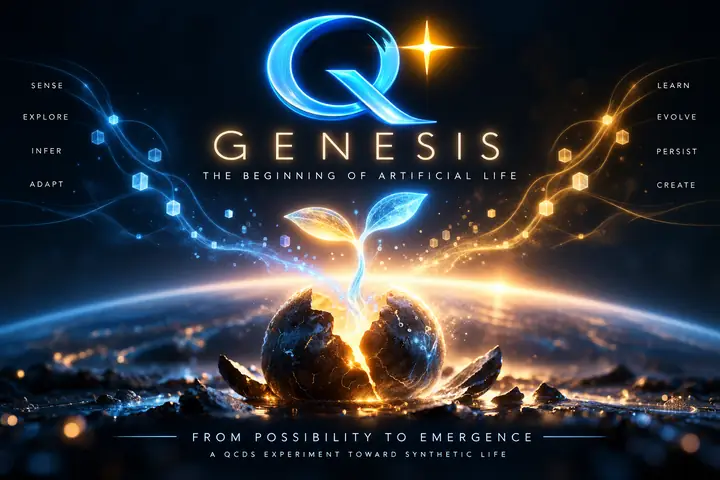

[](qgenesis.webp)

# Q* GENESIS

**The beginning of artificial life.**

Q* GENESIS is an experimental branch of **The Syntract Vision / QCDS** exploring how a minimal synthetic entity can begin with a world, sensing, internal state, inference, choice, action, consequence and recursive adaptation.

The initial direction is deliberately small and inspectable:

```text
WORLD
  ↓
SENSE
  ↓
CONDITION
  ↓
INFER
  ↓
CHOOSE
  ↓
ACT
  ↓
CONSEQUENCE
  ↓
NEW WORLD
  ↺
```

The aim is not to hide behavior inside a large pretrained model, but to make the emergence of increasingly coherent behavior observable and falsifiable.

**Sense · Explore · Infer · Adapt · Learn · Evolve · Persist · Create**

> From possibility to emergence.

---

**Theory and creation by Patrik Sundblom**  
with OpenAI / ChatGPT as research & development support

Theory/concept: **CC BY 4.0**  
Software: **MIT**
